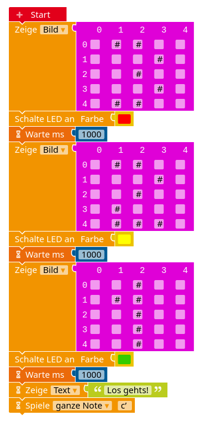

# Eine kurze Einführung zum Calliope und zum Open Roberta Lab

Der Calliope mini ist ein Mikrocontroller, der in Deutschland auf Basis des BBC micro:bit entwickelt wurde. Er bringt einige Sensoren und Aktoren mit und eröffnet damit einen einfachen Einstieg in die Welt des *Physical Computing*, der schon Grundschulkinder begeistert. Die Möglichkeiten des Calliope reichen aber so weit, dass man auch in der Oberstufe noch spannende Projekte mit dem Calliope durchführen kann. Dieses Skript soll dir dabei helfen, einen Einstieg in die Welt des Physical Computing mit Hilfe des Calliope zu finden und darüber hinaus grundlegende Konzepte der Informatik kennen zu lernen. Wenn du Spaß daran gefunden hast, wirst du dich vielleicht auch für den Arduino interessieren, der auf den gleichen Grundlagen beruht, aber noch weit mehr Möglichkeiten bietet.

In diesem Kapitel lernst du...
- ... wie der Calliope aufgebaut ist und welche Sensoren und Aktoren zur Verfügung stehen,
- ... wie man den Calliope mit dem Open Roberta Lab programmiert.

[TOC]

## Der Aufbau des Calliope

Auf dem Calliope sind schon einige Sensoren und Aktoren verbaut, die sich für kreative Projekte nutzen lassen. Die folgende Abbildung aus der Roboterkonfiguration des Open Roberta Lab gibt eine Übersicht.

Neben den markierten Sensoren und Aktoren verfügt der Calliope über die gut erkennbare LED-Matrix, über die sich Bilder und Texte anzeigen lassen. An den goldenen, kreisrunden Anschlüssen lassen sich weitere Bauteile mit Hilfe von Krokodilklemmen oder Bananensteckern anschließen - z. B. ein Servomotor. Dabei ist der mit "-" markierte Anschluss neben dem USB-Anschluss immer der Minuspol und der mit "+" markierte Anschluss neben dem USB-Anschluss immer der Pluspol. Der Calliope arbeitet dabei stets mit einer Spannung von 3,3V. Die Anschlüsse P0 bis P4 lassen sich frei programmieren.

An den weißen *Grove-Konnektoren* A0 und A1 lassen sich weitere Bauteile anschließen.

| | A0 | A1 |
|---|---|---|
|Verbindungsart | seriell | I2C |
| Bauteile | Farbsensor | Ultraschallsensor, Luftfeuchtigkeitssensor, LED-Leiste, 4-Ziffern-Display, Servomotor |

Zudem lässt sich an der Pin-Reihe unter dem Wort "Prozessor" ein Elektromotor anschließen. Der Motortreiber ist schon auf dem Calliope verbaut. Apropos Prozessor: Dieser steuert alle Programme auf dem Calliope und er befindet sich in dem schwarzen Kasten, in dem auch der Temperatursensor verbaut ist.
Wer nun immer noch nicht genug Anschlüsse hat, kann an den zwei Pin-Reihen unter der Motor-Reihe weitere Stecker anlöten und auch diese Pins benutzen. Man sieht also, dass der Calliope sehr, sehr viele Möglichkeiten bietet, um kreativ zu werden!

*Hinweis:* Wer sich für die genauen Bezeichnungen der Bauteile interessiert, wird auf der [Wikipedia-Seite zum Calliope](https://de.wikipedia.org/wiki/Calliope_mini#Hardware) fündig.

## Der Calliope im Open Roberta Lab

Das Open Roberta Lab ist eine Programmierumgebung für verschiedene Roboter-Systeme, die vom Fraunhofer Institut für intelligente Analyse- und Informationssysteme in Bonn entwickelt wird. Nach der Auswahl des eigenen Roboter-Systems, was in diesem Fall der Calliope mini ist, wird eine Reihe von Blöcken zur Verfügung gestellt, mit denen sich der Calliope sehr einfach auf graphische Art und Weise programmieren lässt. Die Blöcke greifen ineinander wie Puzzleteile! Die folgenden Abbildung gibt eine Übersicht über die Funktionen des Open Roberta Lab.

Neben der graphischen Programmierung lässt sich die Wirkung des Programms auch simulieren und man kann sich den Programmcode in der Sprache C++ anzeigen lassen. Am besten lernt man alle diese Funktionen jedoch kennen, indem man sie ausprobiert. Lege am besten sofort los und öffne das Lab unter folgendem Link:

    <a href="https://lab.open-roberta.org" target="_blank">https://lab.open-roberta.org</a>.

## Dein erstes Programm

 
####Test der Funktionsweise

1. Erstelle dein erstes Programm für den Calliope. Du kannst das oben abgebildete Programm nachbauen oder selbst ein eigenes Programm entwerfen.
2. Schließe den Calliope am Computer an und klicke auf das Play-Symbol unten rechts, um das Programm auf den Calliope zu übertragen.
3. Schaue dir an, wie das Programm auf dem Calliope aussieht.
4. Exportiere das Programm, um es auf deinem Computer zu speichern. Gehe dazu ins Menü oben links und auf *exportiere Programm*. Finde das Programm im Download-Ordner deines Computers und benenne es als `Startprogramm.xml`. Speichere es dann an einem sinnvollen Ort ab.
*Hinweis:* Du kannst das Programm im gleichen Menü wieder importieren, um es zu einem späteren Zeitpunkt wieder aufzurufen.

!!!! #### Algorithmus, Anweisung und Argument
!!!!
!!!! 
!!!!
!!!! Ein Programm besteht aus einer Folge von Anweisungen. Man spricht auch von Algorithmen: Ein Algorithmus ist eine eindeutige Handlungsvorschrift zur Lösung eines Problems, die aus endlich vielen Anweisungen besteht (s. [Wikipedia](https://de.wikipedia.org/wiki/Algorithmus)).
!!!!
!!!! Eine Anweisung *kann* ein oder mehrere *Argumente* haben, die zum Beispiel festlegen, welche LED geschaltet oder wie lange gewartet werden soll.