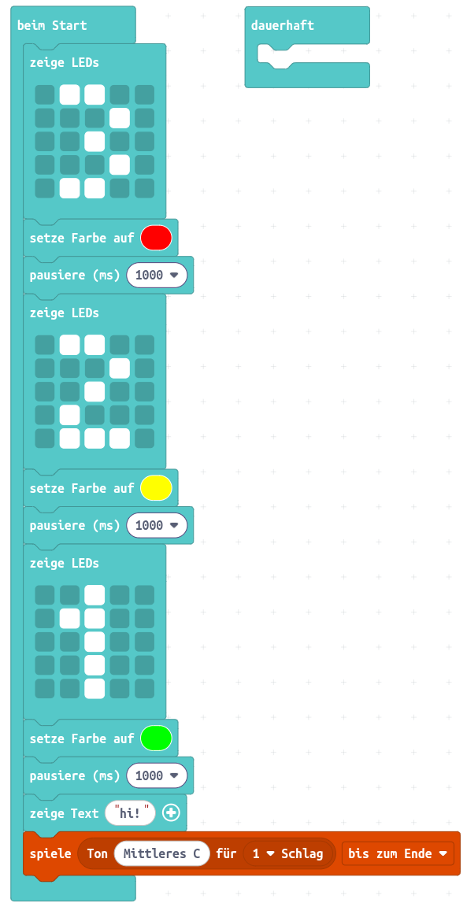
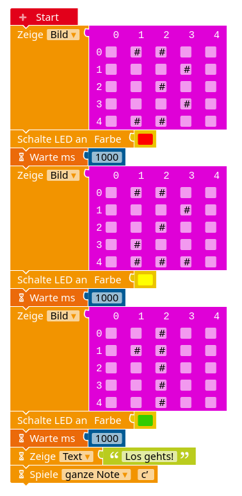
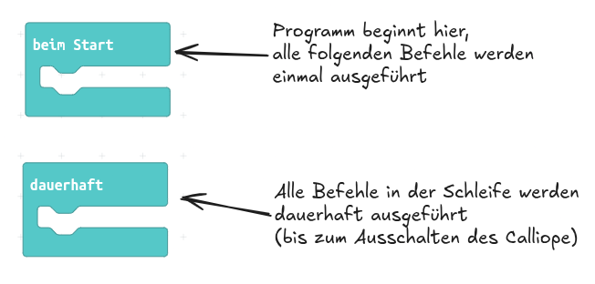
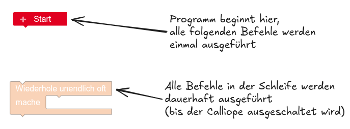

Der Calliope mini ist ein Mikrocontroller, der in Deutschland auf Basis des BBC micro:bit entwickelt wurde. Er bringt einige Sensoren und Aktoren mit und eröffnet damit einen einfachen Einstieg in die Welt des *Physical Computing*, der schon Grundschulkinder begeistert. Die Möglichkeiten des Calliope reichen aber so weit, dass man auch in der Oberstufe noch spannende Projekte mit dem Calliope durchführen kann. Dieses Skript soll dir dabei helfen, einen Einstieg in die Welt des Physical Computing mit Hilfe des Calliope zu finden und darüber hinaus grundlegende Konzepte der Informatik kennen zu lernen. Wenn du Spaß daran gefunden hast, wirst du dich vielleicht auch für den Arduino interessieren, der auf den gleichen Grundlagen beruht, aber noch weit mehr Möglichkeiten bietet.

In diesem Kapitel lernst du...
- ... wie der Calliope aufgebaut ist und welche Sensoren und Aktoren zur Verfügung stehen,
- ... wie man den Calliope mit dem Open Roberta Lab programmiert.

[TOC]

<!--
## Der Aufbau des Calliope

Auf dem Calliope sind schon einige Sensoren und Aktoren verbaut, die sich für kreative Projekte nutzen lassen. Die folgende Abbildung aus der Roboterkonfiguration des Open Roberta Lab gibt eine Übersicht.


Neben den markierten Sensoren und Aktoren verfügt der Calliope über die gut erkennbare LED-Matrix, über die sich Bilder und Texte anzeigen lassen. An den goldenen, kreisrunden Anschlüssen lassen sich weitere Bauteile mit Hilfe von Krokodilklemmen oder Bananensteckern anschließen - z. B. ein Servomotor. Dabei ist der mit "-" markierte Anschluss neben dem USB-Anschluss immer der Minuspol und der mit "+" markierte Anschluss neben dem USB-Anschluss immer der Pluspol. Der Calliope arbeitet dabei stets mit einer Spannung von 3,3V. Die Anschlüsse P0 bis P4 lassen sich frei programmieren.

An den weißen *Grove-Konnektoren* A0 und A1 lassen sich weitere Bauteile anschließen.

| | A0 | A1 |
|---|---|---|
|Verbindungsart | seriell | I2C |
| Bauteile | Farbsensor | Ultraschallsensor, Luftfeuchtigkeitssensor, LED-Leiste, 4-Ziffern-Display, Servomotor |

Zudem lässt sich an der Pin-Reihe unter dem Wort "Prozessor" ein Elektromotor anschließen. Der Motortreiber ist schon auf dem Calliope verbaut. Apropos Prozessor: Dieser steuert alle Programme auf dem Calliope und er befindet sich in dem schwarzen Kasten, in dem auch der Temperatursensor verbaut ist.
Wer nun immer noch nicht genug Anschlüsse hat, kann an den zwei Pin-Reihen unter der Motor-Reihe weitere Stecker anlöten und auch diese Pins benutzen. Man sieht also, dass der Calliope sehr, sehr viele Möglichkeiten bietet, um kreativ zu werden!

*Hinweis:* Wer sich für die genauen Bezeichnungen der Bauteile interessiert, wird auf der [Wikipedia-Seite zum Calliope](https://de.wikipedia.org/wiki/Calliope_mini#Hardware) fündig.
-->

## Die Entwicklungsumgebung

Der Calliope lässt sich mit verschiedenen Entwicklungsumgebungen oder Editoren programmieren. In diesem Skript werden drei Entwicklungsumgebungen vorgestellt: [Makecode](https://calliope.cc/programmieren/editoren/makecode), [Open Roberta Lab](https://calliope.cc/programmieren/editoren/open-roberta) und [Python Editor](https://calliope.cc/programmieren/editoren/python).

! Die Entwicklungsumgebung für Python lässt sich nur mit dem Calliope v3 nutzen.

<div markdown="1" class="aufgabe"> 
#### Entwicklungsumgebung öffnen und abspeichern

1. Öffne den Link zu der von euch im Unterricht verwendeten Entwicklungsumgebung. Die Seite stellt eine Übersicht zu den verschiedenen Funktionen der Entwicklungsumgebung bereit. Speichere den Link zu dieser Seite für den späteren Zugriff.
2. Klicke auf der Übersichtsseite ganz oben auf "Editor starten". Mache dich mit der Entwicklungsumgebung vertraut. (*Sie wird dir auch im Unterricht vorgestellt.*)

</div>

<!--
Das Open Roberta Lab ist eine Programmierumgebung für verschiedene Roboter-Systeme, die vom Fraunhofer Institut für intelligente Analyse- und Informationssysteme in Bonn entwickelt wird. Nach der Auswahl des eigenen Roboter-Systems, was in diesem Fall der Calliope mini ist, wird eine Reihe von Blöcken zur Verfügung gestellt, mit denen sich der Calliope sehr einfach auf graphische Art und Weise programmieren lässt. Die Blöcke greifen ineinander wie Puzzleteile! Die folgenden Abbildung gibt eine Übersicht über die Funktionen des Open Roberta Lab.


Neben der graphischen Programmierung lässt sich die Wirkung des Programms auch simulieren und man kann sich den Programmcode in der Sprache C++ anzeigen lassen. Am besten lernt man alle diese Funktionen jedoch kennen, indem man sie ausprobiert. Lege am besten sofort los und öffne das Lab unter folgendem Link:

<center>
    <a href="https://lab.open-roberta.org" target="_blank">https://lab.open-roberta.org</a>.
</center>
-->

## Deine ersten Programme

<div markdown="1" class="aufgabe"> 
#### Test der Funktionsweise

<!-- Tabs für die Auswahl -->
<div class="tab-group" data-group="programmierumgebung">
<div class="tabs">
  <button class="tab-button" data-umgebung="makecode">Makecode</button>
  <button class="tab-button" data-umgebung="roberta">Open Roberta Lab</button>
  <button class="tab-button" data-umgebung="python">Python</button>
</div>

<!-- Inhalte für jede Programmierumgebung -->
<div class="tab-content">
  <div class="makecode content-block" markdown="1">

  </div>
  <div class="roberta content-block" markdown="1">

  </div>
  <div class="python content-block" markdown="1">

```python
# Imports go at the top
from calliopemini import *
import neopixel
import music
np = neopixel.NeoPixel(pin_RGB, 3)

display.show(3)  # Zahl 3 auf der LED-Marix anzeigen

np.fill((255,0,0)) # füllt alle RGB-LED mit der Farbe rot
np.show()

sleep(1000)  # 1000 ms, also 1 Sek. warten

display.show(2)  # Zahl 2 auf der LED-Marix anzeigen

np.fill((255,255,0)) # füllt alle RGB-LED mit der Farbe gelb
np.show()

sleep(1000)  # 1000 ms, also 1 Sek. warten

display.show(1)  # Zahl 1 auf der LED-Marix anzeigen

np.fill((0,255,0)) # füllt alle RGB-LED mit der Farbe grün
np.show()

sleep(1000)  # 1000 ms, also 1 Sek. warten

display.scroll('hi!')  # lässt Text über das Display laufen

music.play(['c'])  # spielt die Note C
    
```

  </div>
</div>
</div>


1. Erstelle dein erstes Programm für den Calliope. Du kannst das oben abgebildete Programm nachbauen oder selbst ein eigenes Programm entwerfen.
2. Übertrage das Programm auf den Calliope.
3. Schaue dir an, wie das Programm auf dem Calliope aussieht.
4. Speichere das Programm auf dem Computer an einem sinnvollen Ort.

</div>

<details class="details">
<summary class="details__trigger details__title">Zusammenfassung: Algorithmus, Anweisung und Argument</summary>
<div class="details__content" markdown="1">

<div class="notices green" markdown="1">
#### Algorithmus, Anweisung und Argument

Ein Programm besteht aus einer Folge von Anweisungen. Man spricht auch von Algorithmen: Ein Algorithmus ist eine eindeutige Handlungsvorschrift zur Lösung eines Problems, die aus endlich vielen Anweisungen besteht (s. [Wikipedia](https://de.wikipedia.org/wiki/Algorithmus)).

<!-- Tabs für die Auswahl -->
<div class="tab-group" data-group="programmierumgebung">
<div class="tabs">
  <button class="tab-button" data-umgebung="makecode">Makecode</button>
  <button class="tab-button" data-umgebung="roberta">Open Roberta Lab</button>
  <button class="tab-button" data-umgebung="python">Python</button>
</div>

<!-- Inhalte für jede Programmierumgebung -->
<div class="tab-content">
  <div class="makecode content-block" markdown="1">

  </div>
  <div class="roberta content-block" markdown="1">

  </div>
  <div class="python content-block" markdown="1">

```python
# das ganze folgende Programm ist der Algorithmus

# am Anfang werden weitere Programmbausteine importiert
from calliopemini import *
import neopixel
import music
np = neopixel.NeoPixel(pin_RGB, 3)

# nun folgen mehrere Anweisungen mit Argumenten, die nacheinander ausgeführt werden
display.show(1)  # Anweisung: das Display soll die Zahl 1 zeigen. Die Zahl 1 ist das Argument

np.fill((0,255,0))  # Anweisung: RGB-LEDs mit Farbe grün füllen. Die Farbe grün ist das Argument, das als RGB-Tupel angegeben wird
np.show()           # Anweisung: Füllung zeigen (ohne Argument)

sleep(1000)  # Anweisung: warte 1000ms. Das Argument sind die 1000ms

display.scroll('hi!')  # Anweisung: Text über Display laufen lassen. Das Argument ist 'hi!'

music.play(['c'])  # Anweisung: Ton spielen. Das Argument ist das Zeichen 'c' innerhalb einer Liste [], da mehrere Noten hintereinander angegeben werden können, z. B. music.play(['c', 'd', 'e'])
    
```

  </div>
</div>
</div>

Eine Anweisung *kann* ein oder mehrere *Argumente* haben, die zum Beispiel festlegen, welche Farbe oder welcher Text angezeigt werden soll oder wie lange gewartet werden soll. Je nach Anweisung ist das Argument eine Farbe, eine Zahl, ein Text oder Bild.
</div>

</div>
</details>

<div markdown="1" class="aufgabe">
#### Ampel

<!-- Tabs für die Auswahl -->
<div class="tab-group" data-group="programmierumgebung">
<div class="tabs">
  <button class="tab-button" data-umgebung="makecode">Makecode</button>
  <button class="tab-button" data-umgebung="roberta">Open Roberta Lab</button>
  <button class="tab-button" data-umgebung="python">Python</button>
</div>

<!-- Inhalte für jede Programmierumgebung -->
<div class="tab-content">
  <div class="makecode content-block" markdown="1">
1. Programmiere eine einfache Ampel mit der RGB-LED.
2. Verschiebe das Skript vom "Start"-Block in den "dauerhaft"-Block (oder umgekehrt) und beschreibe den Unterschied.
  </div>
  <div class="roberta content-block" markdown="1">
1. Programmiere eine einfache Ampel mit der RGB-LED.
2. Ergänze um das Skript für die Ampel den Block "wiederhole unendlich oft" (aus der Kategorie "Kontrolle"). Beschreibe den Unterschied zu vorher.
  </div>
  <div class="python content-block" markdown="1">
1. Programmiere eine einfache Ampel mit der RGB-LED.
2. Ergänze vor dem Skript für die Ampel eine Zeile mit `while True:` und rücke das Skript für die Ampel ein (alles markieren und Taste TAB drücken, vgl. Beispiel unten). Beschreibe den Unterschied zu vorher.

```python
from calliopemini import *
import neopixel
np = neopixel.NeoPixel(pin_RGB, 3)

while True:
      # folgende eingerückten Anweisungen sind innerhalb der while-Schleife
      np.fill((255,0,0)) # füllt alle RGB-LED mit der Farbe rot
      np.show()

# folgende nicht eingerückte Anweisungen sind nicht mehr innerhalb der while-Schleife
np.fill((255,0,0)) # füllt alle RGB-LED mit der Farbe rot
np.show()
```

  </div>
</div>
</div>

</div>


<details class="details">
<summary class="details__trigger details__title">Zusammenfassung: Schleifen</summary>
<div class="details__content" markdown="1">

<div class="notices green" markdown="1">
#### Schleifen

Schleifen dienen dazu, Programmcode zu wiederholen. Es gibt unterschiedliche Arten von Schleifen, die wir im folgenden kennenlernen werden. Für den Anfang ist die Endlosschleife am wichtigsten, die den enthaltenen Code dauerhaft wiederholt. Unsere Programme werden sich zum größten Teil in einer Endlosschleife abspielen.

<!-- Tabs für die Auswahl -->
<div class="tab-group" data-group="programmierumgebung">
<div class="tabs">
  <button class="tab-button" data-umgebung="makecode">Makecode</button>
  <button class="tab-button" data-umgebung="roberta">Open Roberta Lab</button>
  <button class="tab-button" data-umgebung="python">Python</button>
</div>

<!-- Inhalte für jede Programmierumgebung -->
<div class="tab-content">
  <div class="makecode content-block" markdown="1">

  </div>
  <div class="roberta content-block" markdown="1">

  </div>
  <div class="python content-block" markdown="1">

```python
# die folgenden Befehle werden genau ein Mal beim Start des Programms ausgeführt
from calliopemini import *
import neopixel
np = neopixel.NeoPixel(pin_RGB, 3)

np.fill((255,0,0)) # füllt alle RGB-LED mit der Farbe rot
np.show()

while True:
      # folgende eingerückten Anweisungen werden endlos wiederholt
      np.fill((255,0,0)) # füllt alle RGB-LED mit der Farbe rot
      np.show()

# folgende nicht eingerückte Anweisungen werden nie ausgeführt, weil die obere Endlosschleife nie verlassen wird
np.fill((255,0,0)) # füllt alle RGB-LED mit der Farbe rot
np.show()
```

  </div>
</div>
</div>
</div>

</div>
</details>

<div markdown="1" class="aufgabe">
#### Jukebox

Programmiere ein Lied, das der Calliope abspielt. Recherchiere die Noten dazu im Internet.


*Hinweise:*

Zwei mögliche Beispiele von Melodien mit Link zu den Noten:

-   [“Alle meine Entchen”](https://www.lieder-archiv.de/alle_meine_entchen-notenblatt_100055.html),
-   [“Oh Tannenbaum”](https://www.lieder-archiv.de/o_tannenbaum-notenblatt_200078.html).

*Frequenzen in Hertz zu den Noten:*

<div markdown="1" style="overflow:auto;">
  | $c^1$ | $cis^1/des^1$ | $d^1$ | $dis^1/es^1$ | $e^1$ | $f^1$ | $fis^1/ges^1$ | $g^1$ | $gis^1/as^1$ | $a^1$ | $ais^1/b^1$ | $h^1$ |
  |-------|---------------|-------|--------------|-------|-------|---------------|-------|--------------|-------|-------------|-------|
  | 262   |     277       | 294   |    311       | 330   | 349   |     370       | 392   |    415       | 440   |   466       | 494   |
</div>

</div>


## Aufbau des Calliope - Sensoren und Aktoren


