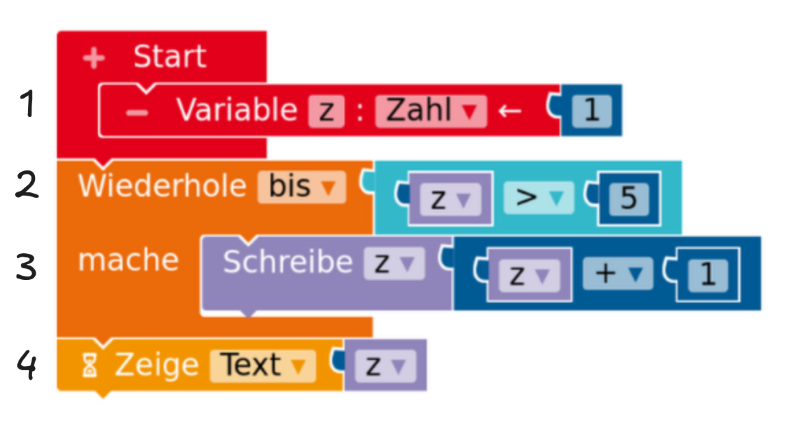
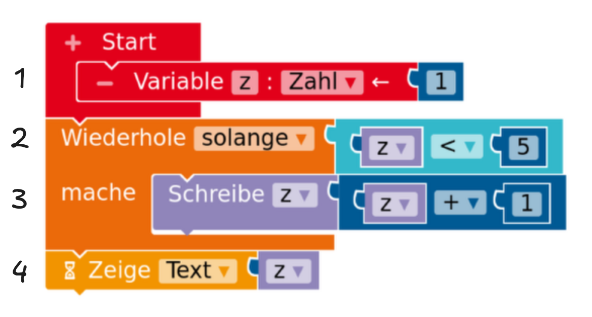

#### Variableneinsatz

Das folgende Beispiel zeigt den Einsatz einer Variable namens `zaehler`.

1. Analysiere das Programm:
	- Wie wird eine Variable eingeführt?
	- Welche Ausgabe macht der Calliope?
	- Was ist die letzte angezeigte Zahl?
2. Teste, ob du richtig liegst.
3. Erstelle ein Programm ohne Variable, das die gleiche Ausagbe erzeugt.
4. Vergleiche beide Programme. Begründe, warum der Einsatz einer Variable sinnvoll ist.

#### Variableneinsatz II

Das folgende zweite Beispiel zeigt eine Alternative zur Anpassung des Variablenwertes.

1. Stelle eine Vermutung an, welche Ausgabe dieses Programm erzeugt.
2. Teste deine Vermutung.

#### Variablen

Eine Variable kann man sich als Koffer vorstellen, der einen Namen bekommt und in dem man einen festgelegten Datentyp speichert. Jedes Mal, wenn der Name des Koffers aufgerufen wird, wird der abgespeicherte Wert hervorgeholt und an die Stelle des Namens gesetzt. Intern wird der Variablenname als Verweis auf einen bestimmten Speicherplatz genutzt, in dem der Wert der Variable abgelegt ist.

Für den Namen hat sich der <a href="https://de.wikipedia.org/wiki/Binnenmajuskel#Programmiersprachen">lowerCamelCase</a> etabliert: Der erste Buchstabe ist klein; wenn weitere Wörter folgen, fangen diese mit einem großen Buchstaben an. Leerzeichen sind nicht erlaubt.

#### Wiederholschleifen mit Zähler vergleichen und verstehen

1. Vergleiche die beiden unten dargestellten Schleifen.
2. Ermittle jeweils den Wert, der auf dem Calliope angezeigt wird. Stelle dazu den Programmablauf mit einer Trace-Tabelle dar (siehe unten).

 

 

!!!! #### Trace-Tabellen
!!!!
!!!! 

!!!! 
 Trace-Tabellen stellen den Wert von Variablen beim Durchlaufen des Programms dar. Auf diese Art und Weise kann man sich zum Beispiel genau veranschaulichen, wann Schleifen abgebrochen werden.

!!!! 

!!!!  |**Zeile** | **counter** |
!!!!  |----------|-------|
!!!!  |   1   |  1  |
!!!!  |   2    |   1   |
!!!!  |   3      |   1   |
!!!!  |   4      |   2   |
!!!!  |   3      |   2   |
!!!!  |   4      |   3   |
!!!! 

!!!! 

#### Berechnung mit einer Wiederholschleife

1. Stelle eine Vermutung an, welche Zahl mit dem vorliegenden Programm berechnet werden soll.
2. Überprüfe deine Vermutung und führe den Algorithmus durch. Stelle dazu den Programmablauf in einer Trace-Tabelle dar.

