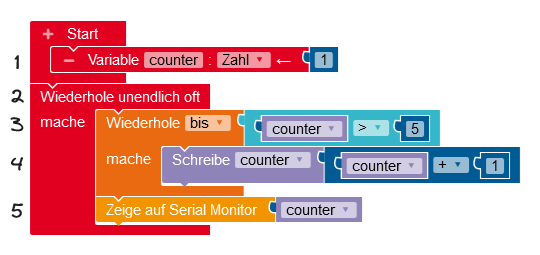
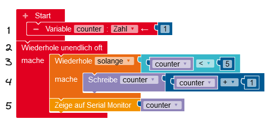

#### Wiederholschleifen vergleichen und verstehen

1. Vergleiche die beiden unten dargestellten Schleifen.
2. Ermittle jeweils den Wert, der auf dem Seriellen Monitor angezeigt wird. Stelle dazu den Programmablauf mit einer Trace-Tabelle dar (siehe unten).

 

 

!!!! #### Trace-Tabellen
!!!!
!!!! 

!!!! 
 Trace-Tabellen stellen den Wert von Variablen beim Durchlaufen des Programms dar. Auf diese Art und Weise kann man sich zum Beispiel genau veranschaulichen, wann Schleifen abgebrochen werden.

!!!! 

!!!!  |**Zeile** | **counter** |
!!!!  |----------|-------|
!!!!  |   1   |  1  |
!!!!  |   2    |   1   |
!!!!  |   3      |   1   |
!!!!  |   4      |   2   |
!!!!  |   3      |   2   |
!!!!  |   4      |   3   |
!!!! 

!!!! 

#### Berechnung mit einer Wiederholschleife

1. Stelle eine Vermutung an, welche Zahl mit dem vorliegenden Programm berechnet werden soll.
2. Überprüfe deine Vermutung und führe den Algorithmus durch. Stelle dazu den Programmablauf in einer Trace-Tabelle dar.

