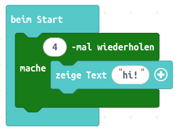
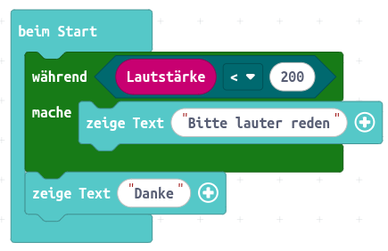
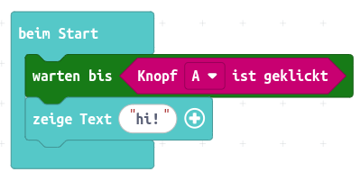
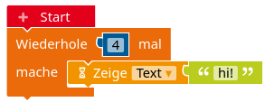
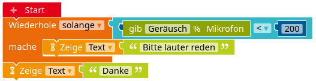
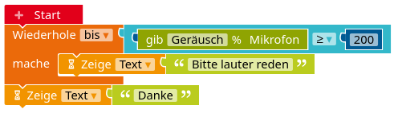
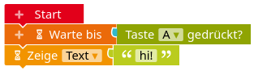

[TOC]

**Ziel:** Der Bastelbot soll um einen Ultraschallsensor erweitert werden, sodass er Hindernisse erkennen und umfahren kann.


### Programmierung

<div markdown="1" class="aufgabe">
#### Erster Test

1. Recherchiere die [Funktionsweise und Programmierung des Ultraschallsensors](/physical-computing-calliope/bauteilkunde/sensoren-calliope/ultraschallsensor).
2. Programmiere den Roboter so, dass er geradeaus fährt und möglichst genau 20cm vor einem Hindernis stoppt.
</div>

<div markdown="1" class="aufgabe">
#### Endlosfahrt

Programmiere den Roboter so, dass er bei freier Bahn geradeaus fährt. Wenn er aber ein Hindernis "sieht", soll er sich um 90 Grad drehen, damit er wieder freie Fahrt hat. Dies wird endlos wiederholt, sodass der Roboter immer weiter fährt.
</div>

<div markdown="1" class="aufgabe">
#### Variable Geschwindigkeit

Programmiere den Roboter so, dass er schnell fährt, wenn kein Hindernis in Sicht ist und langsamer, wenn er ein Hindernis erkennen kann. Wenn das Hindernis zu nah kommt, dreht sich der Roboter und fährt in eine andere Richtung.
</div>

<div markdown="1" class="aufgabe">
#### Einparken

Programmiere den Roboter so, dass er möglichst genau 5cm vor einer Wand stoppt. Er wird bereits vorher immer langsamer und gibt dabei Töne ab. Je näher der Roboter dem Hindernis kommt, desto schneller folgen die Töne aufeinander.
</div>


<details class="details">
<summary class="details__trigger details__title">Zusammenfassung: Arten von Verzweigungen</summary>
<div class="details__content" markdown="1">
<div class="notices green" markdown="1">
#### Arten von Verzweigungen

Mit Verzweigungen kann man den Calliope je nach Situation anders reagieren lassen. Dazu wird die Ausführung der Anweisungen an eine oder mehrere Bedingungen gekoppelt. Diese Bedingung muss entweder "wahr" oder "falsch" ergeben, um eindeutig zu entscheiden, ob die Anweisungen ausgeführt werden sollen oder nicht.

<!-- Tabs für die Auswahl -->
<div class="tab-group" data-group="programmierumgebung">
<div class="tabs">
  <button class="tab-button" data-umgebung="makecode">Makecode</button>
  <button class="tab-button" data-umgebung="roberta">Open Roberta Lab</button>
  <button class="tab-button" data-umgebung="python">Python</button>
</div>

<!-- Inhalte für jede Programmierumgebung -->
<div class="tab-content">
  <div class="makecode content-block" markdown="1">


Als Bedingung eignen sich sechseckige Blöcke. Manche Sensoreingaben, wie zum Beispiel das Drücken einer Taste, kann man direkt als Bedingung verwenden (erkennbar an der sechseckigen Form). Bei anderen Sensorblöcken, die z. B. eine Zahl bereitstellen, erhält man die Bedingung erst durch den Vergleich mit einer anderen Zahl, sodass aus dem Vergleich ein Wahrheitswert (wahr/falsch) entsteht. Die Zahl, die zum Vergleich herangezogen wird, nennt man auch "Schwellwert".

<div markdown="1" class="flex-box">
<div markdown="1"> und kann als Bedingung für Verzweigungen verwendet werden.")</div>
<div markdown="1"></div>
</div>

**Wichtig:** Die folgenden Blöcke sind keine Verzweigungen, sondern sogenannte **Ereignisse**. 

Ereignisse unterbrechen das eigentlich ablaufende Programm in der Endlosschleife, wenn das angegebene Ereignis eintritt. Diese Unterbrechung sollte immer *möglichst kurz* sein, weil das Programm sonst bei mehreren Ereignissen zu viel hin- und herspringt und man den Überblick verliert. Insbesondere sind (Endlos-)Schleifen innerhalb eines Ereignisses ein *No-Go*.
  </div>
  <div class="roberta content-block" markdown="1">


Als Bedingung eignen sich hellblaue Blöcke. Manche Sensoreingaben, wie zum Beispiel das Drücken einer Taste, kann man auch direkt als Bedingung verwenden (erkennbar an der hellblauen Nase). Bei anderen Sensorblöcken erhält man erst durch den Vergleich mit einer Zahl einen Wahrheitswert (wahr oder falsch). Die Zahl, die zum Vergleich herangezogen wird, nennt man auch *Schwellwert*.

<div markdown="1" class="flex-box">
<div markdown="1"> und kann als Bedingung für Verzweigungen verwendet werden.")</div>
<div markdown="1"></div>
</div>
  </div>
  <div class="python content-block" markdown="1">

```python
# Imports go at the top
from calliopemini import *

# Code in a 'while True:' loop repeats forever
while True:
    if button_a.is_pressed():      # die Funktion "is_pressed()" liefert einen Wahrheitswert (wahr/falsch)
        display.scroll('Fall 1')   # wird ausgeführt, falls Knopf A gedrückt wurde
```
Programm A: Einfache Verzweigung

```python
# Imports go at the top
from calliopemini import *

# Code in a 'while True:' loop repeats forever
while True:
    if button_a.is_pressed():      # die Funktion "is_pressed()" liefert einen Wahrheitswert (wahr/falsch)
        display.scroll('Fall 1')   # wird ausgeführt, falls Knopf A gedrückt wurde
    else:
        display.clear()            # wird ausgeführt, falls Kopf A *nicht* gedrückt wurde

```
Programm B: Verzweigung mit sonst-Fall

<pre><code class="language-python">
# Imports go at the top
from calliopemini import *

# Code in a 'while True:' loop repeats forever
while True:
    if button_a.is_pressed():      # die Funktion "is_pressed()" liefert einen Wahrheitswert (wahr/falsch)
        display.scroll('Fall 1')   # wird ausgeführt, falls Knopf A gedrückt wurde
    elif (microphone.sound_level() &gt; 125):  # die Funktion "sound_level()" liefert eine Zahl von 0 bis 255
                                            # erst durch den Vergleich dieser Zahl mit 125 wird daraus ein Wahrheitswert (wahr/falsch)
        display.scroll('Fall 2')            # wird ausgeführt, falls Knopf A NICHT gedrückt wurde, aber Knopf B gedrückt wurde
    else:                          
        display.clear()            # wird ausgeführt, falls Knopf A NICHT gedrückt wurde und Knopf B NICHT gedrückt wurde

</code></pre>
Programm C: Verschachtelte Verzweigung

Die Bedingung muss immer wahr oder falsch ergeben. Manche Sensoreingaben, wie zum Beispiel das Drücken einer Taste, kann man über eine Funktion direkt als Bedingung verwenden (z. B. `is_pressed()`). Bei anderen Sensoreingaben, die z. B. eine Zahl bereitstellen (z. B. `sound_level()`), erhält man die Bedingung erst durch den Vergleich mit einer anderen Zahl, sodass aus dem Vergleich ein Wahrheitswert (wahr/falsch) entsteht. Die Zahl, die zum Vergleich herangezogen wird, nennt man auch "Schwellwert".

</div>
</div>


</div>
</div>
</details>
      
<details class="details">
<summary class="details__trigger details__title">Zusammenfassung: Einfache Schleifen</summary>
<div class="details__content" markdown="1">
<div class="notices green" markdown="1">
#### Einfache Schleifen

Mit Hilfe von Schleifen kann man Anweisungen mehrfach ausführen.

<!-- Tabs für die Auswahl -->
<div class="tab-group" data-group="programmierumgebung">
<div class="tabs">
  <button class="tab-button" data-umgebung="makecode">Makecode</button>
  <button class="tab-button" data-umgebung="roberta">Open Roberta Lab</button>
  <button class="tab-button" data-umgebung="python">Python</button>
</div>

<!-- Inhalte für jede Programmierumgebung -->
<div class="tab-content">
  <div class="makecode content-block" markdown="1">

Einfache Zählschleife: Der Calliope zeigt 4 Mal "hi!" an.


Kopfgesteuerte Schleife: Die Anweisung wird wiederholt, solange die Bedingung wahr ist. In diesem Fall wird auf dem Display "Bitte lauter reden" angezeigt, solange die Lautstärke kleiner als 200 ist.
Wenn die Lautstärke größer gleich 200 ist, hört die Schleife auf und es wird "Danke" angezeigt.


"Warte,bis": Der Calliope macht nichts, bis die Bedingung wahr ist. In diesem Fall wartet der Calliope, bis Taste A gedrückt wurde.

Als Bedingung eignen sich sechseckige Blöcke. Manche Sensoreingaben, wie zum Beispiel das Drücken einer Taste, kann man direkt als Bedingung verwenden (erkennbar an der sechseckigen Form). Bei anderen Sensorblöcken, die z. B. eine Zahl bereitstellen, erhält man die Bedingung erst durch den Vergleich mit einer anderen Zahl, sodass aus dem Vergleich ein Wahrheitswert (wahr/falsch) entsteht. Die Zahl, die zum Vergleich herangezogen wird, nennt man auch "Schwellwert".
  </div>
  <div class="roberta content-block" markdown="1">

Einfache Zählschleife: Der Calliope zeigt 4 Mal "hi!" an.


Kopfgesteuerte Schleife mit "solange": Die Anweisung wird wiederholt, *solange* die Bedingung wahr ist. In diesem Fall wird auf dem Display "Bitte lauter reden" angezeigt, solange die Lautstärke kleiner als 200 ist.
Wenn die Lautstärke größer gleich 200 ist, hört die Schleife auf und es wird "Danke" angezeigt.


Kopfgesteuerte Schleife mit "bis": Die Anweisung wird wiederholt, *bis* die Bedingung wahr ist. In diesem Fall wird auf dem Display "Bitte lauter reden" angezeigt, bis die Lautstärke größer gleich als 200 ist.
Wenn die Lautstärke größer gleich 200 ist, hört die Schleife auf und es wird "Danke" angezeigt.

Man kann eine "solange"-Schleife in eine "bis-Schleife" umwandeln, indem man die jeweilige Bedingung verneint.



"Warte,bis": Der Calliope macht nichts, bis die Bedingung wahr ist. In diesem Fall wartet der Calliope, bis Taste A gedrückt wurde.

Als Bedingung eignen sich hellblaue Blöcke. Manche Sensoreingaben, wie zum Beispiel das Drücken einer Taste, kann man auch direkt als Bedingung verwenden (erkennbar an der hellblauen Nase). Bei anderen Sensorblöcken erhält man erst durch den Vergleich mit einer Zahl einen Wahrheitswert (wahr oder falsch). Die Zahl, die zum Vergleich herangezogen wird, nennt man auch *Schwellwert*.

<div markdown="1" class="flex-box">
<div markdown="1"> und kann als Bedingung für Verzweigungen verwendet werden.")</div>
<div markdown="1"></div>
</div>
  </div>
  <div class="python content-block" markdown="1">

<pre><code class="language-python">
# Imports go at the top
from calliopemini import *

########################################################

# while-Schleife:
# solange die Lautstärke kleiner als 200 ist, zeigt der Calliope an,
# dass man lauter reden soll
while microphone.sound_level() < 200:
    display.scroll("Bitte lauter reden")

# wenn die Lautstärke über oder gleich 200 ist, hört die Schleife auf
# und der Calliope sagt "Danke"
display.scroll("Danke")

########################################################

# einfache Zählschleife:
# der Calliope zeigt 4 Mal "hi!" an
for i in range(4):  
    display.scroll("hi!")

########################################################

# "warte, bis"-Schleife
# diese wird in Python mit einer while-Schleife umgesetzt
# "warte, bis Taste A gedrückt" entspricht nämlich
# "mache nichts (pass), solange Taste A nicht gedrückt ist"
while not( button_a.is_pressed() ):
    pass

# wenn Taste A gedrückt wurde, hört die Schleife auf und
# der Calliope sagt "hi!"
display.scroll("hi!")

</code></pre>
Mehrere Schleifen in einem Programm

Die Bedingung einer while-Schleife muss immer wahr oder falsch ergeben. Manche Sensoreingaben, wie zum Beispiel das Drücken einer Taste, kann man über eine Funktion direkt als Bedingung verwenden (z. B. `is_pressed()`). Bei anderen Sensoreingaben, die z. B. eine Zahl bereitstellen (z. B. `sound_level()`), erhält man die Bedingung erst durch den Vergleich mit einer anderen Zahl, sodass aus dem Vergleich ein Wahrheitswert (wahr/falsch) entsteht. Die Zahl, die zum Vergleich herangezogen wird, nennt man auch "Schwellwert".

</div>
</div>


</div>
</div>
</details>
