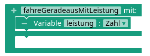
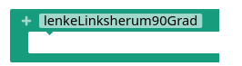
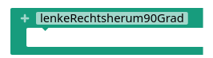

[TOC]

## Funktionen


<div markdown="1" class="aufgabe">
#### Funktionen für das Fahren

Die Programme werden handlicher und übersichtlicher, wenn die einzelnen Fahrfunktionen auch als Funktion im Programm umgesetzt werden. Implementiere die unten abgebildeten Funktionen.

<!-- Tabs für die Auswahl -->
<div class="tab-group" data-group="programmierumgebung">
<div class="tabs">
  <button class="tab-button" data-umgebung="makecode">Makecode</button>
  <button class="tab-button" data-umgebung="roberta">Open Roberta Lab</button>
  <button class="tab-button" data-umgebung="python">Python</button>
</div>

<!-- Inhalte für jede Programmierumgebung -->
<div class="tab-content">
  <div class="makecode content-block" markdown="1">
<div class="flex-box">
<div markdown="1" class="flexible"></div>
<div markdown="1" class="flexible"></div>
<div markdown="1" class="flexible"></div>
<div markdown="1" class="flexible"></div>
<div markdown="1" class="flexible"></div>
</div>
  </div>
  <div class="roberta content-block" markdown="1">
<div class="flex-box">
<div markdown="1" class="flexible"></div>
<div markdown="1" class="flexible"></div>
<div markdown="1" class="flexible"></div>
</div>
  </div>
  <div class="python content-block" markdown="1">
```python
def vorwaerts_fahren(geschwindigkeit):  # geschwindigkeit von 0 bis 1023
    pass

def rueckwaerts_fahren(geschwindigkeit): # geschwindigkeit von 0 bis 1023
    pass

def stoppen():
    pass

def lenke_rechts_um_90_grad():
    pass

def lenke_links_um_90_grad():
    pass

def fahre(geschwindigkeitLinks, geschwindigkeitRechts): # geschwindigkeit jeweils von 0 bis 1023
    pass


```
  </div>
</div>
</div>
</div>


### Detailanalyse des Fahrverhaltens

Wie verlässlich und genau ist das Fahrverhalten des Roboters? Und lässt sich durch eine genaue Analyse eine Funktion erstellen, bei der man dem Roboter sagen kann, wie weit er fahren soll? Darum gehts im Folgenden.

<div markdown="1" class="aufgabe">
#### Wie genau fährt der Roboter?

1. Falls bisher noch nicht geschehen: Lasse den Roboter mehrmals geradeaus fahren und beobachte, ob der Roboter tatsächlich geradeaus fährt. Beseitige Fehlerquellen so gut es geht: Dreckige Räder, eiernde Räder, ...
2. Entwickle einen Versuch zur Untersuchung der Genauigkeit des Fahrverhaltens. Führe ihn (mehrmals) durch und dokumentiere die Ergebnisse.

</div>

<div markdown="1" class="aufgabe">
#### Zeit und Strecke

Es wäre praktisch, dem Roboter genau sagen zu können, wie weit er fahren soll und nicht nur, mit welcher Leistung er fahren soll. Genau das ist das Ziel dieser Aufgabe.

Für diese Aufgabe gilt: **Der Roboter fährt immer mit der Leistung 50%.**

1. Entwickle einen Versuch zur Messung der Strecke, die der Roboter innerhalb von 2, 4, 6, 8, 10 Sekunden zurücklegt.
2. Stelle die Ergebnisse in einem Zeit-Weg-Diagramm dar.
3. Ermittle die Geschwindigkeit des Roboters in cm pro Sekunde.
4. Ermittle die Funktion $s(t)$, wobei $s$ die zurückgelegte Strecke in cm und $t$ die benötigte Zeit in Sekunden ist.
5. Ermittle die Funktion $t(s)$, wobei $s$ die Strecke ist, die der Roboter zurücklegen soll, und $t$ die Zeit in Millisekunden, die die Motoren dafür laufen müssen.
6. Implementiere eine Funktion `fahre_cm_mit_50Prozent( strecke )`, wobei `strecke` die Strecke in cm ist, die der Roboter zurücklegen soll.

</div>

<div markdown="1" class="aufgabe">
#### Leistung und Strecke

Nun wird es umgedreht: Die Zeit bleibt immer dieselbe, aber der Roboter fährt mit unterschiedlicher Leistung. Ziel ist, auch den Zusammenhang von zurückgelegter Strecke und Leistung genau zu erfassen.

Für diese Aufgabe gilt: **Der Roboter fährt immer für 5 Sekunden.**

1. Entwickle einen Versuch zur Messung der Strecke, die der Roboter bei einer Leistung von 20%, 40%, 60%, 80%, 100% zurücklegt.
2. Stelle die Ergebnisse in einem Leistung-Weg-Diagramm dar.
3. Ermittle die Funktion $s(l)$, wobei $s$ die zurückgelegte Strecke in cm und $l$ die vorgegebene Leistung in Prozent ist. Deute den Schnittpunkt der erhaltenen Funktion mit der Rechtsachse.
4. Ermittle die Funktion $l(s)$, wobei $s$ die Strecke ist, die der Roboter zurücklegen soll, und $l$ die Leistung in Prozent, die der Roboter braucht, um die Strecke innerhalb der 5 Sekunden zu schaffen.
5. Implementiere eine Funktion `fahre_cm_in_5Sek( strecke )`, wobei `strecke` die Strecke in cm ist, die der Roboter zurücklegen soll.

</div>

<div markdown="1" class="aufgabe">
#### Leistung, Zeit und Strecke

Nach den vorherigen zwei Vorbereitungen ist nun das Ziel, beide Untersuchungen zusammen zu fassen und eine Funktion zu implementieren, bei der man gleichzeitig angeben kann, wie weit der Roboter fahren soll und mit welcher Leistung der die Strecke fahren soll.

<details class="details">
<summary class="details__trigger details__title">Vorbemerkung 1: Zusammenfassen von zwei Proportionalitäten</summary>
<div class="details__content" markdown="1">
Für die Zusammenfassung der beiden Untersuchungen wird folgende Voraussetzung genutzt: Wenn die Größe A proportional zur Größe B und proportional zur Größe C ist, dann ist sie auch proportional zum Produkt $B \cdot C$.

Wenn $A \propto B$ und $A \propto C$ gilt, dann gilt auch $A \propto B \cdot C$.

Anders formuliert:

Wenn $\frac{A}{B} = konst.$ und $\frac{A}{C} = konst.$ gilt, dann gilt auch $\frac{A}{B \cdot C} = konst.$
</div>
</details>

<details class="details">
<summary class="details__trigger details__title">Vorbemerkung 2: Anwendung auf die vorliegenden Zusammenhänge</summary>
<div class="details__content" markdown="1">
Nach den vorherigen Untersuchungen wissen wir: Die Strecke ist proportional zur Zeit ( $s \propto t$).

Aber sie ist nicht proportional zur Leistung. Ein linearer Zusammenhang lässt sich aber wie im folgenden Beispiel umformen:

$s(l) = 0,5 \cdot l - 5 = 0,5 \cdot (l - \frac{5}{0,5}) = 0,5 \cdot ( l - 10)$.

In diesem Beispiel wäre die Strecke $s$ also proportional zur Größe $(l-10)$: $s \propto (l-10)$.
</div>
</details>

1. Forme deinen funktionalen Zusammenhang aus der Aufgabe "Leistung und Strecke" so um, wie in Vorbemerkung 2 gezeigt.
2. Fasse beide Proportionalitäten entsprechend der Vorbemerkung 1 zusammen.
3. Bestimme den gemeinsamen Proportionalitätsfaktor, indem du den Quotienten $\frac{A}{B \cdot C}$ bestimmst.
4. Forme das Ergebnis nun nach der Zeit $t$ um.
5. Implementiere die Funktion `fahre_cm_mit_Leistung( strecke, leistung)`, wobei `strecke` die Strecke in cm ist, die der Roboter fahren soll, und `leistung` die Leistung in Prozent ist, mit der der Roboter fahren soll (d.h. für 20% wird `20` eingegeben). *Tipp:* Denke daran, dass die Zeit, die mit der Formel aus Aufgabenteil 4 berechnet wird, die Zeit in Sekunden ist und im Block `pausiere ...` die Zeit in Millisekunden benötigt wird.

</div>

