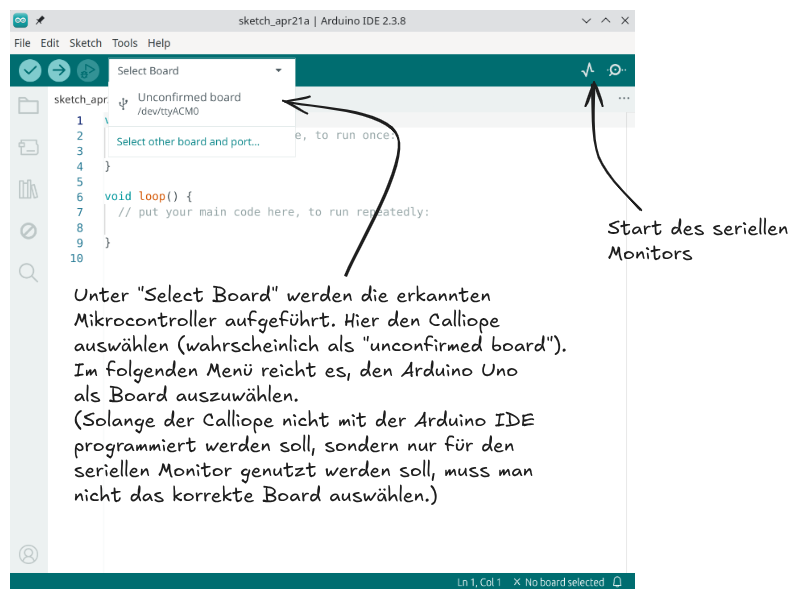

[TOC]

<div markdown="1" class="clearfix">

Aktivitätstracker mit Pulsmessung liegen voll im Trend - aber wie funktioniert so ein Pulssensor eigentlich? Das lässt sich am einfachsten verstehen, wenn man selber einen nachbaut. Weitere Anwendungsmöglichkeiten wären übrigens Lügen-/Angstdetektoren, Schlafanalyse oder ein Alarmsystem für Risikopatienten.
</div>

## Verbindung mit der Pinleiste

### Schaltung


Das Signalkabel S (in der Schaltskizze orange eingezeichnet) muss mit einem Pin verbunden werden, der ein analoges Signal lesen kann. Dafür kommen folgende Pins in Frage: P0, P1, P2, C4, C10, C16, C18. Achtung: Die Pins können schon an anderer Stelle verwendet worden sein, z. B. über die Ringpads (P0, P1, P2) oder den Grove-Anschluss A1 (betrifft C16). Siehe für doppelt belegte Pins auch die [Dokumentation zur Pinbelegung des Calliope](https://docs.calliope.cc/tech/hardware/pins/).

### Programmierung

<!-- Tabs für die Auswahl -->
<div class="tab-group" data-group="programmierumgebung">
<div class="tabs">
  <button class="tab-button" data-umgebung="makecode">Makecode</button>
  <button class="tab-button" data-umgebung="roberta">Open Roberta Lab</button>
  <button class="tab-button" data-umgebung="python">Python</button>
</div>

<!-- Inhalte für jede Programmierumgebung -->
<div class="tab-content">
  <div class="makecode content-block" markdown="1">
Zum Auslesen des Pulssensors lässt man sich aus der Kategorie "Pins" den analogen Wert des entsprechenden Pins (hier P0) anzeigen.

Für das Auslesen der Werte bietet es sich an, den analogen Wert über die serielle Schnittstelle (USB-Kabel) an den Computer schicken zu lassen und dort visualisieren zu lassen. Der Befehl dazu findet sich in der Kategorie "Seriell". Nach dem Übertragen des Programms kann man im linken Fensterbereich auf "Daten anzeigen Calliope mini" auswählen und bekommt die unten abgebildete Ansicht.
<div class="flex-box">
<div markdown="1">

</div>
<div markdown="1">

</div>
</div>
Achtung: Die "korrekten" Werte schwanken in einem sehr kleinen Bereich, im Screenshot oben zwischen 509 und 531. Daher lässt sich der Puls erst als solcher erkennen, wenn die Skala von Makecode entsprechend fein gewählt wurde.


Um Ausreißer bzw. unpassende Werte von Vornherein auszusortieren, kann man im obigen Beispiel nur die Werte ausgeben, deren Abstand zu 500 nicht größer als 100 ist. Dies wird im folgenden Programm umgesetzt.

.")

Die Werte vom Pulssensor schwanken jedoch je nach Person und Umgebung. Daher kann es auch sein, dass sie eher um den Wert 400 oder 600 schwanken. Man sollte unbedingt darauf achten, dass die Haut nicht verschwitzt ist und keine Bauteile auf dem Sensor berührt werden (insbesondere auf der Rückseite), damit die Ergebnisse einigermaßen zuverlässig sind. Wenn sich auf dem Arm keine brauchbaren Werte einstellen, lohnt sich ein Versuch auf dem Ringfinger oder dem Ohrläppchen.

  </div>
  <div class="roberta content-block" markdown="1">

Zum Auslesen des Pulssensors muss man zunächst den Signalpin als analogen Sensor konfigurieren.


      
! Bei der Konfiguration als analoger Sensor stehen nicht alle oben aufgezählten Pins zur Auswahl. Dies ist ein Bug im Open Roberta Lab (Stand: 01.04.26). Insbesondere ist auch der Pin P0 nicht als analoger Sensor auswählbar, weshalb anders als in oben dargestellten Schaltskizze der Pin P1 als analoger Sensor ausgewählt wird. **Wenn der Pin P1 als analoger Sensor konfiguriert wird, sollte er dementsprechend auch mit dem Pulssensor verbunden werden.**

Für das Auslesen der Werte bietet es sich an, den analogen Wert über die serielle Schnittstelle (USB-Kabel) an den Computer schicken zu lassen und dort visualisieren zu lassen. Für die Visualisierung, also die Darstellung in einem Graphen, lässt sich die Arduino IDE nutzen (siehe Anleitung unten).

<details class="details">
<summary class="details__trigger details__title">Visualisierung mit dem Seriellen Plotter der Arduino IDE</summary>
<div class="details__content" markdown="1">
**0.** Vorbereitung: Damit überhaupt Werte über den seriellen Port (USB) übermittelt werden, erstelle ein Programm, das fortlaufend den aktuellen Wert des Pulssensors auf den seriellen Monitor schreibt und übertrage es auf den Arduino.

**1.** Der Serielle Plotter ist in die Arduino IDE eingebaut, die genutzt wird, um den Arduino textbasiert zu programmieren. [Lade die Arduino IDE herunter](https://www.arduino.cc/en/software) und installiere sie.

**2.** Öffne die Arduino IDE. Zuerst muss der USB-Port und das verwendete Board verbunden werden (siehe Bild). Als Board kann man den Arduino Uno  (oder irgendein anderes Board) auswählen, solange der Calliope nicht programmiert werden soll, sondern nur der serielle Monitor bzw. Plotter verwendet werden soll. Danach kann der serieller Plotter geöffnet werden. Falls keine Werte angezeigt werden, dann kontrolliere, ob die Baud-Rate (unten links) auf 9600 eingestellt ist.



</div>
</details>

<div class="flex-box">
<div markdown="1">

</div>
<div markdown="1">

</div>
</div>
Achtung: Die "korrekten" Werte schwanken in einem sehr kleinen Bereich, im Screenshot oben zwischen 508 und 535. Daher lässt sich der Puls erst als solcher erkennen, wenn die Skala von der Arduino IDE entsprechend fein gewählt wurde.


Um Ausreißer bzw. unpassende Werte von Vornherein auszusortieren, kann man im obigen Beispiel nur die Werte ausgeben, deren Abstand zu 500 nicht größer als 100 ist. Dies wird im folgenden Programm umgesetzt.

.")

Die Werte vom Pulssensor schwanken jedoch je nach Person und Umgebung. Daher kann es auch sein, dass sie eher um den Wert 400 oder 600 schwanken. Man sollte unbedingt darauf achten, dass die Haut nicht verschwitzt ist und keine Bauteile auf dem Sensor berührt werden (insbesondere auf der Rückseite), damit die Ergebnisse einigermaßen zuverlässig sind. Wenn sich auf dem Arm keine brauchbaren Werte einstellen, lohnt sich ein Versuch auf dem Ringfinger oder dem Ohrläppchen.


  </div>
  <div class="python content-block" markdown="1">
Zum Auslesen des Pulssensors lässt man sich den analogen Wert des entsprechenden Pins (hier P0) anzeigen.

Für das Auslesen der Werte bietet es sich an, den analogen Wert über die serielle Schnittstelle (USB-Kabel) an den Computer schicken zu lassen und dort visualisieren zu lassen. Für die Visualisierung, also die Darstellung in einem Graphen, lässt sich die Arduino IDE nutzen (siehe Anleitung unten).

<details class="details">
<summary class="details__trigger details__title">Visualisierung mit dem Seriellen Plotter der Arduino IDE</summary>
<div class="details__content" markdown="1">
**0.** Vorbereitung: Damit überhaupt Werte über den seriellen Port (USB) übermittelt werden, erstelle ein Programm, das fortlaufend den aktuellen Wert des Pulssensors auf den seriellen Monitor schreibt und übertrage es auf den Arduino.

**1.** Der Serielle Plotter ist in die Arduino IDE eingebaut, die genutzt wird, um den Arduino textbasiert zu programmieren. [Lade die Arduino IDE herunter](https://www.arduino.cc/en/software) und installiere sie.

**2.** Öffne die Arduino IDE. Zuerst muss der USB-Port und das verwendete Board verbunden werden (siehe Bild). Als Board kann man den Arduino Uno  (oder irgendein anderes Board) auswählen, solange der Calliope nicht programmiert werden soll, sondern nur der serielle Monitor bzw. Plotter verwendet werden soll. Danach kann der serieller Plotter geöffnet werden. Falls keine Werte angezeigt werden, dann kontrolliere, ob die Baud-Rate (unten links) auf 9600 eingestellt ist.


</div>
</details>

<div class="flex-box">
<div markdown="1">
```python
# Imports go at the top
from calliopemini import *

# Code in a 'while True:' loop repeats forever
while True:
    print(pin0.read_analog())
    sleep(100)
```
Programm zum Auslesen des Pulssensors.
</div>
<div markdown="1">

</div>
</div>
Achtung: Die "korrekten" Werte schwanken in einem sehr kleinen Bereich, im Screenshot oben zwischen 508 und 535. Daher lässt sich der Puls erst als solcher erkennen, wenn die Skala von der Arduino IDE entsprechend fein gewählt wurde.


Um Ausreißer bzw. unpassende Werte von Vornherein auszusortieren, kann man im obigen Beispiel nur die Werte ausgeben, deren Abstand zu 500 nicht größer als 100 ist. Dies wird im folgenden Programm umgesetzt.

<pre><code class="language-python">
# Imports go at the top
from calliopemini import *

# Code in a 'while True:' loop repeats forever
while True:
    neuer_messwert = pin0.read_analog()    # speichern des Messwerts in Variable
    if ( abs(neuer_messwert - 500) &lt; 100):   # abs( neuer_messwert - 500 ) liefert den betragsmäßigen Abstand (abs) von 500
        print(neuer_messwert)
        sleep(100)
    else:
        sleep(200)
</code></pre>

Die Werte vom Pulssensor schwanken jedoch je nach Person und Umgebung. Daher kann es auch sein, dass sie eher um den Wert 400 oder 600 schwanken. Man sollte unbedingt darauf achten, dass die Haut nicht verschwitzt ist und keine Bauteile auf dem Sensor berührt werden (insbesondere auf der Rückseite), damit die Ergebnisse einigermaßen zuverlässig sind. Wenn sich auf dem Arm keine brauchbaren Werte einstellen, lohnt sich ein Versuch auf dem Ringfinger oder dem Ohrläppchen.


  </div>
</div>
</div>

## Aufgaben

<div markdown="1" class="aufgabe">
#### Theorie: Wie wird der Puls gemessen?

Für die Messung des Pulses ist die grüne LED und ein Lichtsensor zentral. Erkläre anhand der schematischen Abbildungen unten das Prinzip der optischen Pulsmessung.
<div class="flex-box">
<div markdown="1"></div>
<div markdown="1"></div>
<div markdown="1"></div>
</div>
</div>

<div markdown="1" class="projekt">
#### Pulsmesser
Baue einen Pulsmesser, der anhand der Messwerte von 10 Sekunden den Puls (Herzschläge pro Minute) berechnet.

*Hinweis: Es kann nötig sein, sich die Werte von einem seriellen Plotter visualisieren zu lassen, um einen Eindruck vom Wertebereich und von der Grenze für die Herzschlagerkennung zu bekommen. Klappe dafür die Anleitung unter diesem Projekt aus.*
</div>

