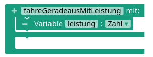
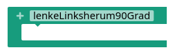
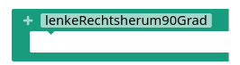

Nachdem der Roboter nun über ein Fahrgestell verfügt und die Motoren verkabelt sind, wird es Zeit, ihm das Fahren beizubringen!

## Programmierung der Motoren

<!-- Tabs für die Auswahl -->
<div class="tab-group" data-group="programmierumgebung">
<div class="tabs">
  <button class="tab-button" data-umgebung="makecode">Makecode</button>
  <button class="tab-button" data-umgebung="roberta">Open Roberta Lab</button>
  <button class="tab-button" data-umgebung="python">Python</button>
</div>

<!-- Inhalte für jede Programmierumgebung -->
<div class="tab-content">
  <div class="makecode content-block" markdown="1">
In der Kategorie "Motoren" gibt es dazu den Block "Motor ... an mit ...%", der es erlaubt, die Leistung der Motoren einzustellen:
- "50%" bedeutet, die Motoren drehen sich mit halber Leistung vorwärts,
- "0%" bedeutet, die Motoren bleiben stehen,
- "-50%" bedeutet, die Motoren drehen sich mit halber Leistung rückwärts.


  </div>
  <div class="roberta content-block" markdown="1">
Zunächst müssen die Motoren konfiguriert werden. Dabei werden die Anschlüsse von Motor M0 als Port A bezeichnet und diejenigen von Motor M1 als Port B. Es ist sinnvoll, die Benennung der Motoren so vorzunehmen, dass man gleich sieht, welcher Motor links und welcher rechts am Roboter angebracht ist.


In der Kategorie "Aktion" -> "Bewegen" finden sich einige Blöcke zum Steuern der Motoren. Die Werte für das Tempo in % können dabei von -100 (maximale Geschwindigkeit rückwärts) bis 100 (maximale Geschwindigkeit vorwärts) reichen.


  </div>
  <div class="python content-block" markdown="1">
    Die Motor-Befehle finden sich in der Referenz unter "Motoren". Dort gibt es auch bereits einige hilfreiche Erklärungen und auswählbare Beispiele.

```python
# Imports go at the top
from calliopemini import *

# Code in a 'while True:' loop repeats forever
while True:
    # vorwärts
    pin_M_MODE.write_digital(1)
    
    pin_M0_DIR.write_digital(0)  # Motor M0 vorwärts
    pin_M1_DIR.write_digital(0)  # Motor M1 vorwärts
    
    pin_M0_SPEED.write_analog(1023)  # Motor M0 mit voller Geschwindigkeit
    pin_M1_SPEED.write_analog(1023)  # Motor M1 mit voller Geschwindigkeit

    sleep(1000)  # für 1 Sekunde fahren
    
    # Stoppen
    pin_M_MODE.write_digital(1)
    
    pin_M0_DIR.write_digital(1)  # Motor M0 rückwärts
    pin_M1_DIR.write_digital(1)  # Motor M1 rückwärts
    
    pin_M0_SPEED.write_analog(0)  # Motor M0 Stopp (Geschwindigkeit 0)
    pin_M1_SPEED.write_analog(0)  # Motor M1 Stopp (Geschwindigkeit 0)

    sleep(1000)  # für 1 Sekunde stoppen
    
```

  </div>
</div>
</div>

## Aufgaben

!! #### Sicherheitshinweis
!! Bevor der Calliope per USB-Kabel am Computer angeschlossen wird, muss die **Batterie stets abgeklemmt werden**. Ziehe dazu das rote Kabel vom Pluspol heraus. Das schwarze Kabel vom Minuspol kann stecken bleiben, da die Verbindung bereits unterbrochen ist. So musst du später nur ein Kabel wieder einstecken und dir dabei nicht merken, wohin "+" und "-" müssen, weil das Kabel vom Minuspol ja noch steckt.

<div markdown="1" class="aufgabe">
#### Vor und zurück

1. Füge ein Skript hinzu, sodass sich die Motoren stoppen lassen, wenn die Taste B gedrückt wird. Dies ist hilfreich, wenn du das nächste Programm übertragen willst.
2. Füge ein Skript zum Vorwärts- oder Rückwärtsfahren hinzu und beobachte die Motoren. Wenn sie sich falsch herum drehen, musst du die Kabel der Motoren anders herum am Calliope anschließen.
</div>

<div markdown="1" class="aufgabe">
#### Quadratfahren


1. Markiere auf dem Boden ein Quadrat mit Seitenlänge 1m.
2. Lass den Roboter das Quadrat abfahren! Sorge dafür, dass die Fahrt erst startet, wenn du auf Taste A gedrückt hast.

Tipp: Damit sich der Roboter auf der Stelle dreht, lasse einen Motor vorwärts und den anderen rückwärts drehen (eine sogenannte "Hebelsteuerung"). Füge danach eine Pause mit dem Block "pausiere ... ms" ein, die genau so lang ist, dass sich der Roboter um 90° dreht.
</div>

<div markdown="1" class="aufgabe">
#### Funktionen für das Fahren

Die Programme werden handlicher und übersichtlicher, wenn die einzelnen Fahrfunktionen auch als Funktion im Programm umgesetzt werden. Implementiere die unten abgebildeten Funktionen.

<!-- Tabs für die Auswahl -->
<div class="tab-group" data-group="programmierumgebung">
<div class="tabs">
  <button class="tab-button" data-umgebung="makecode">Makecode</button>
  <button class="tab-button" data-umgebung="roberta">Open Roberta Lab</button>
  <button class="tab-button" data-umgebung="python">Python</button>
</div>

<!-- Inhalte für jede Programmierumgebung -->
<div class="tab-content">
  <div class="makecode content-block" markdown="1">
<div class="flex-box">
<div markdown="1" class="flexible"></div>
<div markdown="1" class="flexible"></div>
<div markdown="1" class="flexible"></div>
<div markdown="1" class="flexible"></div>
<div markdown="1" class="flexible"></div>
</div>
  </div>
  <div class="roberta content-block" markdown="1">
<div class="flex-box">
<div markdown="1" class="flexible"></div>
<div markdown="1" class="flexible"></div>
<div markdown="1" class="flexible"></div>
</div>
  </div>
  <div class="python content-block" markdown="1">
```python
def vorwaerts_fahren(geschwindigkeit):  # geschwindigkeit von 0 bis 1023
    pass

def rueckwaerts_fahren(geschwindigkeit): # geschwindigkeit von 0 bis 1023
    pass

def stoppen():
    pass

def lenke_rechts_um_90_grad():
    pass

def lenke_links_um_90_grad():
    pass

def fahre(geschwindigkeitLinks, geschwindigkeitRechts): # geschwindigkeit jeweils von 0 bis 1023
    pass


```
  </div>
</div>
</div>


</div>