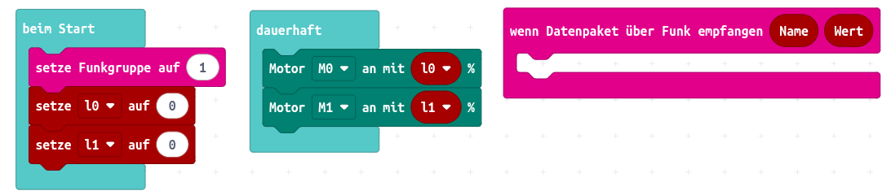
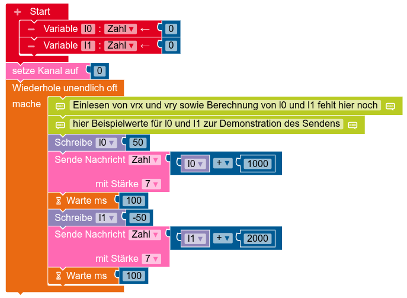
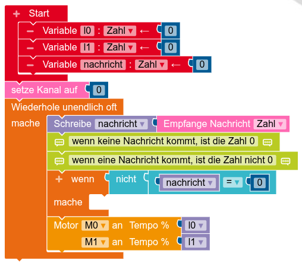

[TOC]

**Ziel:** Mit Hilfe eines zweiten Calliope und einem Joystick soll eine Fernsteuerung für den Bastelbot entwickelt werden!


## Fernsteuerung per Joystick

Mit Hilfe eines Joysticks lässt sich der Roboter intuitiv steuern. Dabei werden zwei Ideen verfolgt. Die erste Idee ist deutlich einfacher umzusetzen, aber bei der Steuerung weniger intuitiv. Dafür ist sie gleichzeitig eine gute Vorbereitung für die zweite Idee.

.")

<div markdown="1" class="aufgabe">
#### Funktionstest des Senders

1. Recherchiere die Funktionsweise des [Joysticks](/physical-computing-calliope/bauteilkunde/sensoren-calliope/joystick) und lasse seine analogen Werte über die serielle Schnittstelle ausgeben. 
2. Erkunde, in welche Richtung der Joystick bewegt werden muss, um nur den x-Wert ($vrx$) oder nur den y-Wert ($vry$) zu verändern. 
3. Notiere die Werte für die unten abgebildeten Ausschläge. Der Joystick wird dabei so gehalten, dass die Kabel nach rechts zeigen.


</div>

<div markdown="1" class="aufgabe">
#### Idee 1: Drehachsen entsprechen Motorleistung

Die erste Idee zur Fernsteuerung des Roboters ist die, dass jede der Drehachsen des Joysticks (entsprechend $vrx$ und $vry$) die Leistung eines Motors steuert. Im Folgenden bezeichnen wir die Leistung von Motor M0 als $l_0$ und die Leistung von Motor M1 als $l_1$. 

Wenn der Joystick in der Mitte steht, ist die jeweilige Motorleistung 0. Wenn der Joystick in x-Richtung nach links ausgelenkt wird, wird $l_0$ erhöht, bis sie 100% erreicht. Bei einer Bewegung nach rechts, wird $l_0$ verringert, bis sie -100% erreicht. Entsprechend für die y-Richtung.


1. Ordne den Punkten P1 bis P4 in der oberen Abbildung die folgenden Situationen zu: Geradeaus fahren, Linksdrehung, Rechtsdrehung, Rückwärtsfahren (jeweils mit maximaler Leistung).
2. Vervollständige die folgende Tabelle zur Übersetzung von Potentiometerwerten des Joysticks in Motorleistungen.

<div class="flex-box">
<div markdown="1">
Übersetzung von Potentiometerwert $vrx$ in Motorleistung $l_0$ von Motor M0

| $vrx$ | $l_0$ |
| --- | --- |
| 0 | |
| 512 | |
| 1023 | |
</div>
<div markdown="1">
Übersetzung von Potentiometerwert $vry$ in Motorleistung $l_1$ von Motor M1

| $vry$ | $l_1$ |
| --- | --- |
| 0 | |
| 512 | |
| 1023 | |
</div>
</div>

3. Finde eine Formel zur Berechnung von $l_0$ aus $vrx$ und zur Berechnung von $l_1$ aus $vry$. Die Abbildung unten visualisiert den Vorgang dieser *Koordinatentransformation*.


4. Entwickle zwei Programme zur Fernsteuerung des Roboters per Joystick:
**Sender:** Der Sender liest die Werte vom Joystick ein und berechnet daraus die Motorleistungen `l0` und `l1`. Dann sendet er diese jeweils an den Empfänger. *Hinweis: Sprecht euch in der Klasse ab, wer welche Funkgruppe nutzt, damit jeder Roboter die richtigen Befehle empfängt!*
**Empfänger:** Der Empfänger liest aus, welche Leistung übermittelt wurde und setzt die entsprechende Variable für die Motorleistung auf den empfangenen Wert. Nutze dazu die unten abgebildete Vorlage.

<!-- Tabs für die Auswahl -->
<div class="tab-group" data-group="programmierumgebung">
<div class="tabs">
  <button class="tab-button" data-umgebung="makecode">Makecode</button>
  <button class="tab-button" data-umgebung="roberta">Open Roberta Lab</button>
  <button class="tab-button" data-umgebung="python">Python</button>
</div>

<!-- Inhalte für jede Programmierumgebung -->
<div class="tab-content">
  <div class="makecode content-block" markdown="1">
**Befehl für den Sender:**


**Vorlage für den Empfänger:**


  </div>
  <div class="roberta content-block" markdown="1">
Um unterscheiden zu können, ob die Leistung `l0` oder die Leistung `l1` gesendet wird, wird die Leistung `l0` vor dem Senden mit 1000 addiert und die Leistung `l1` mit 2000. Der Empfänger muss dann prüfen, wie groß die empfangene Zahl ist, um zu entscheiden, ob sie für `l0` oder `l1` gesetzt werden soll.

**Vorlage für den Sender:**


**Vorlage für den Empfänger:**


  </div>
  <div class="python content-block" markdown="1">
Um unterscheiden zu können, ob die Leistung `l0` oder die Leistung `l1` gesendet wird, wird die Leistung `l0` vor dem Senden mit 1000 addiert und die Leistung `l1` mit 2000. Der Empfänger muss dann prüfen, wie groß die empfangene Zahl ist, um zu entscheiden, ob sie für `l0` oder `l1` gesetzt werden soll.

**Vorlage für den Sender:**
```python
# Imports go at the top
from calliopemini import *
import radio

radio.on()
radio.config(group=0)

# Variablen für die Motorleistung
l0 = 0
l1 = 0

while True:
    # TODO: Einlesen von vrx und vry sowie Berechnung von l0 und l1 fehlt hier noch
    
    # im Folgenden Beispielwerte für l0 und l1 zur Demonstration des Sendens,
    # diese müssen wieder entfernt werden, wenn oberes TODO abgearbeitet ist
    l0 = 50
    l1 = -50
    
    # Wert von l0 wird mit 1000 addiert und in eine Zeichenkette (String) umgewandelt,
    # da nur Zeichenketten versendet werden können
    radio.send(str(l0 + 1000))
    sleep(100)

    # Wert von l1 wird mit 2000 addiert und in eine Zeichenkette (String) umgewandelt,
    # da nur Zeichenketten versendet werden können
    radio.send(str(l1 + 2000))
    sleep(100)
```

**Vorlage für den Empfänger:**

Für die Programmierung mit Python hätte die Koordinatentransformation oben auch anders aussehen können, da die Ansteuerung der Motoren in Python nicht über eine Leistung von -100 bis 100 erfolgt, sondern über einen Befehl für die Richtung und einen Befehl für die Drehgeschwindigkeit mit Werten von 0 bis 1023. Wenn man jedoch wie in den anderen Programmiersprachen eine Leistung von -100 bis 100 sendet, dann kann man anhand dieser Leistung leicht die Drehrichtung und einen (absoluten) Wert für die Drehgeschwindigkeit von 0 bis 1023 berechnen lassen.

```python
# Imports go at the top
from calliopemini import *
import radio

radio.on()
radio.config(group=0)

# Variablen für die Motorleistung
l0 = 0
l1 = 0

while True:
    nachricht = radio.receive()
    # wenn keine Nachricht ankommt, ist der Variableninhalt None und dies liefert im Folgenden False
    # wenn eine Nachricht ankommt, liefert die folgende Abfrage True
    if nachricht:
        # Umwandeln von Zeichenkette in Zahl
        nachricht = float(nachricht)
        # TODO: Setzen der Motorleistung l0 bzw. l1, je nach Größe der empfangenen Zahl
        

    # Motoren anstellen
    pin_M_MODE.write_digital(1)

    # TODO: Auswertung der Drehrichtung
    

    # TODO: Werte umrechnen: l0 bzw. l1 liegt zwischen -100 und 100, gebraucht wird ein Wert lM0 bzw. lM1 zwischen 0 und 1023
    # dazu neue Variable anlegen, um Auswertung der Drehrichtung im nächsten Durchlauf der Schleife
    # nicht zu verfälschen

    lM0 = 
    lM1 = 
    
    # Leistung der Motoren festlegen
    pin_M0_SPEED.write_analog(lM0)
    pin_M1_SPEED.write_analog(lM1)

    sleep(100)

```

  </div>
</div>
</div>

</div>


<div markdown="1" class="aufgabe">
#### Idee 2: Drehachsen für Vorwärts/Rückwärts und Links/Rechts

Die zweite Idee entspricht eher dem, was man intuitiv von einer Joystick-Steuerung erwarten würde: Eine Drehachse des Joysticks ($vry$) steuert, ob und wie stark der Roboter nach vorne bzw. hinten fährt. Die andere Drehachse des Joysticks ($vrx$) steuert, ob und wie stark der Roboter nach links bzw. rechts fährt. Die mathematischen Überlegungen dazu sind deutlich komplizierter und es ist hilfreich, wenn man bereits die erste Idee vorher umgesetzt hat.


1. Ordne den Punkten P1 bis P4 in der oberen Abbildung die folgenden Situationen zu: Geradeaus fahren, Linksdrehung, Rechtsdrehung, Rückwärtsfahren (jeweils mit maximaler Leistung). Notiere für jeden Punkt passende Motorleistungen $l_0$ und $l_1$ für Motor M0 und M1.
2. Zur Berechnung der Motorleistungen anhand der Auslenkungen $vrx$ und $vry$ des Joysticks lässt sich das folgende Gleichungssystem aufstellen. Begründe die beiden Gleichungen.
\[
\left|
\begin{array}
 l_0 + l_1 = 2 \cdot \frac{vry - 512}{5,12} \\
 l_0 - l_1 = \frac{vrx - 512}{5,12}
\end{array}
\right|
\]

</div>
