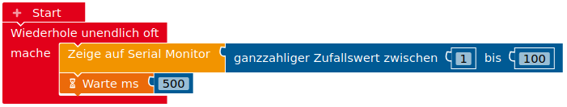

Viele Dinge werden interessanter, wenn sie sich nicht immer auf die genau gleiche Art wiederholen. Für diese Fälle kann man im Programm den blauen Block für Zufallszahlen verwenden (Expertenblöcke aktivieren!), der jedes Mal eine neue Zufallszahl erzeugt, wenn er aufgerufen wird.

Ein einfaches Beispiel ist die “Bombe”, die man bei dem Spiel “Tick Tack Bumm” startet und die man so lange herum geben muss, bis sie explodiert. Dabei ist die Dauer des Tickens ein zufälliger Wert zwischen ca. 5s und 20s.

<video controls="1" width="70%" height="auto" playsinline>
<source src="/user/pages/images/bombe.mp4" type="video/mp4"></source>
<source src="/user/pages/images/bombe.webm" type="video/webm"></source>
Ihr Browser kann dieses Video nicht wiedergeben.
</video>

#### Bombe bauen

Baue und programmiere eine “Bombe”, die für eine zufällige Dauer zwischen 5s und 20s tickt und dann explodiert. Die Bombe wird über einen Taster aktiviert.

Zusatz: Welchen Unterschied macht es, wenn man die ausgewürfelte Zufallszahl in einer Variable speichert?

#### Exkurs: Zufallszahlen von Mikrocontrollern/Mikroprozessoren

Übertrage das unten abgebildete Programm auf den Arduino und betrachte die so erzeugten Zufallszahlen. Drücke dann auf den Reset-Taster am Arduino und betrachte die nun erzeugten Zufallszahlen. Wiederhole den Vorgang einige Male und beschreibe Auffälligkeiten.

#### Reaktionszeitmesser

Baue und programmiere einen Reaktionszeitmesser.

Der Reaktionszeitmesser soll zunächst warten, bis ein Taster gedrückt wurde, der besagt, dass es losgehen kann. Dann wird eine LED angeschaltet (Vorwiderstand!) und nach einer zufälligen Zeit wieder ausgeschaltet. Nun beginnt die Zeitmessung. Die Stoppuhr läuft solange, bis der Taster gedrückt wurde. Die gemessene Zeit wird dann über den seriellen Monitor ausgegeben und es wird erneut gewartet, bis der Anwender bestätigt, dass es losgehen kann.

Miss mindestens zehn Mal deine Reaktionszeit und bestimme den Mittelwert. Bist du besser als dein Partner?

*Idee: Frick, Fritsch und Trick (2015): Einführung in Mikrocontroller - Der Arduino als Steuerzentrale, Bad Saulgau*

