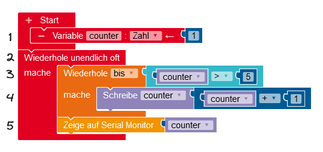
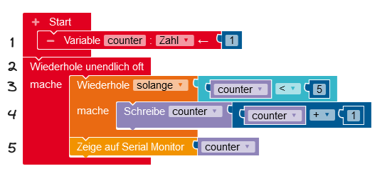

In vielen Fällen geht es bei Schleifen nicht um eine genau oder zufällig bestimmte Anzahl von Wiederholungen, sondern darum, einen Vorgang zu wiederholen, bis eine Bedingung wahr ergibt, bzw. solange, wie eine Bedingung wahr ergibt. Die Bedingung, die wahr oder falsch ergibt, kann auch Sensorwerte beinhalten.

#### Alarmanlage

Baue und programiere eine Alarmanlage, die wie folgt funktioniert: Wenn über einen Bewegungsmelder eine Bewegung registriert wird, dann geht die Alarmanlage los (Blinken und / oder Piepsen). Die Alarmanlage bleibt so lange aktiv, bis ein Taster gedrückt wurde, um sie wieder auszustellen.

#### Wiederholschleifen vergleichen und verstehen

1. Vergleiche die beiden unten dargestellten Schleifen.
2. Ermittle jeweils den Wert, der auf dem Seriellen Monitor angezeigt wird. Stelle dazu den Programmablauf mit einer Trace-Tabelle dar (siehe unten).

 

 

!!!! #### Trace-Tabellen
!!!!
!!!! 

!!!! 
 Trace-Tabellen stellen den Wert von Variablen beim Durchlaufen des Programms dar. Auf diese Art und Weise kann man sich zum Beispiel genau veranschaulichen, wann Schleifen abgebrochen werden.

!!!! 

!!!!  |**Zeile** | **counter** |
!!!!  |----------|-------|
!!!!  |   1   |  1  |
!!!!  |   2    |   1   |
!!!!  |   3      |   1   |
!!!!  |   4      |   2   |
!!!!  |   3      |   2   |
!!!!  |   4      |   3   |
!!!! 

!!!! 

#### Berechnung mit einer Wiederholschleife

1. Stelle eine Vermutung an, welche Zahl mit dem vorliegenden Programm berechnet werden soll.
2. Überprüfe deine Vermutung und führe den Algorithmus durch. Stelle dazu den Programmablauf in einer Trace-Tabelle dar.

#### Konfigurierbares Reaktionsspiel

Baue und programmiere ein konfigurierbares Reaktionsspiel!

Dazu werden drei Taster (mit Widerstand!) am Arduino angeschlossen. Nach einer zufälligen Zeit wird auf dem seriellen Monitor angezeigt, welcher (zufällig ausgewürfelte) Taster gedrückt werden soll. Geschieht dies innerhalb einer vorgegebenen maximalen Reaktionszeit, hat man gewonnen, andernfalls verloren.

Am Anfang des Spiels soll diese maximale Reaktionszeit konfiguriert werden können. Das heißt, man kann die max. Reaktionszeit mit dem linken Taster verringern und mit dem rechten Taster vergrößern. Erst wenn der mittlere Taster gedrückt wird, startet das Spiel.

Für einen besseren Zugang zu diesem komplexen Spiel kannst du folgende Vorlage öffnen, mittels “Speichern unter” als `Reaktionsspiel.xml` auf dem Computer speichern und die Datei im Open Roberta Lab importieren: <a href="/p-templates/reaktionsspiel-start.xml" download><i class="fa fa-download" aria-hidden="true"></i> reaktionsspiel-start.xml</a>.

*Mögliche Erweiterungen:*
-   zusätzliche Ausgabe der Reaktionszeit,
-   Ober- und Untergrenze für die einstellbare maximale Reaktionszeit, damit das Spiel nicht unmöglich, aber auch nicht zu langweilig wird,
-   nach Spielstart folgen mehrere Spiele hintereinander und es wird mitgezählt, wie oft gewonnen wird,
-   je nach Reaktionszeit bekommt man mehr oder weniger Punkte,
-   ...

