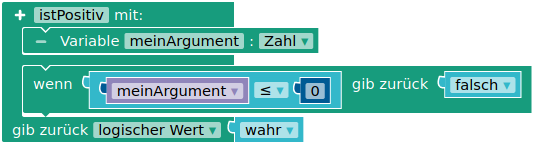

## Eigene Funktionen definieren

In den letzten Abschnitten ist bereits deutlich geworden, dass es manchmal praktisch sein kann, sich eigene Blöcke zu definieren. In der Programmiersprache C++, in der der Quellcode für den Arduino generiert wird, werden diese “Funktion” genannt.

**Frage:** Wie kann man in Nepo Funktionen implementieren?

 
#### Bekannte Funktionen aufgeschlüsselt

In der Abbildung unten ist zu sehen, wie man Funktionen implementiert, mit denen sich LEDs an Pin 2 bis 4 über ihre Pin-Nummer anschalten und ausschalten lassen. Beschreibe, wie die Funktion zum Anschalten aufgebaut ist und genutzt wird.

In der Funktion zum Ausschalten kann die Variable `pin` nicht genutzt werden (sichtbar durch (x)). Was bedeutet dies für die Variablen, die in Funktionen angelegt werden?

#### Blöcke zum Warten und zum Blinken

1. Implementiere einen Block `warteSekunden` mit dem Argument `pauseInSekunden`, der den Arduino für die angegebene Anzahl an Sekunden warten lässt.

2. Implementiere einen Block `blinke` mit den Argumenten `anzahl` und `pauseInMSek`, die die Board-LED für die angegebene Anzahl und mit der angegebenen Pause in Millisekunden zum Blinken bringt. Überprüfe deinen Block.

Was passiert, wenn eine Kommazahl übergeben wird?

#### Mathematische Funktionen

Funktionen in der Informatik und Funktionen in der Mathematik sind sehr ähnlich: Funktionen in der Mathematik ordnen in der Regel einer oder mehreren Zahlen eine neue Zahl zu. Dies lässt sich über die Parameter und den Rückgabewert eines Funktionsblocks umsetzen.

Implementiere ein Programm mit den oben abgebildeten Funktionen, sodass diese eine korrekte Ausgabe liefern.

#### Lesbarkeit und Rückgabewerte

Die Logik für die [Straßenlaterne](/arduinoskript/algorithmische-grundlagen/bausteine-von-algorithmen/der-serielle-monitor#straßenlampe) lautete: Wenn es dunkel ist, schalte die Lampe an, sonst schalte die Lampe aus.

Mit einem eigenen Block lässt sich diese Logik direkt im Programm umsetzen, sodass es noch besser lesbar wird. Implementiere einen Block `istDunkel`, der basierend auf den Werten eines angeschlossenen LDR an A0 einen Wahrheitswert zurückgibt.

*Tipp:* Nutze ggf. die Hilfefunktion (?) auf der rechten Seite, um dich mit den abgebildeten Blöcken vertraut zu machen.

!!!! #### Funktionen
!!!!
!!!! 
!!!! Funktionen fassen mehrere Anweisungen zusammen und können als eigene Anweisung im Algorithmus genutzt werden, um ihn lesbarer und modularer zu machen, wenn an einigen Stellen die gleichen Anweisungen immer wieder benötigt werden. Für den Namen der Funktion gilt wiederum die [lowerCamelCase](https://de.wikipedia.org/wiki/Binnenmajuskel#Programmiersprachen)-Konvention.
!!!! 
!!!! Funktionen können mehrere Argumente von unterschiedlichem Typ haben, die die Art der Ausführung variieren können. Die Variablen, in denen diese Argumente gespeichert werden, sind lokale Variablen und daher nur innerhalb der Funktion verfügbar.
!!!! 
!!!! Außerdem können Funktionen einen Wert zurückgeben, der für den “Hauptalgorithmus” genutzt werden kann. Die Rückgabe eines Wertes muss nicht am Ende der Funktion erfolgen. Wenn bereits vor dem Ende ein Wert zurückgegeben wird, wird der Rest der Funktion nicht mehr ausgeführt.

Die Bezeichnung “Computer”, zu deutsch: “Rechner”, besagt schon, dass man die Entwicklung von Mikrocontrollern und Mikroprozessoren immer auch dazu diente, Rechnungen zu automatisieren, die ein Rechner wesentlich schneller, präziser und fehlerfreier vornehmen kann als ein Mensch. Die Grundrechenarten sind schon als Blöcke in Nepo implementiert. Damit lassen sich auch auf schnelle Art weitere Berechnungen anstellen, für die ein Mensch mehrere Minuten oder sogar Stunden bräuchte.

#### Teilbarkeit durch 2

Unten ist ein Programm abgebildet, mit dem die Teilbarkeit durch 2 überprüft wird. Erläutere seinen Ablauf.

#### Primzahlen

Primzahlen sind natürliche Zahlen, die nur durch 1 und sich selbst teilbar sind. Die kleinste mögliche Primzahl ist 2.

Primzahlen haben die Menschen seit jeher fasziniert, weil man bis heute keine Formel gefunden hat, um Primzahlen zu berechnen. Im Wesentlichen ist man darauf angewiesen, alle möglichen Teiler auszuprobieren und auf diese Art herauszufinden, ob eine Zahl eine Primzahl ist oder nicht. Unter anderem aufgrund dieser “Sperrigkeit” eignen sich Primzahlen gut zur Verschlüsselung.

 Implementiere einen Block `istPrimzahl` mit einer Zahl `x` als Argument und einem Wahrheitswert als Rückgabewert. Sorge dafür, dass Kommazahlen sofort als falsch erkannt werden. Für den Primzahltest kannst du zunächst für alle Zahlen von 2 bis $x-1$ überprüfen, ob sie Teiler von $x$ sind. Der Mathe-Block `…ist Primzahl` darf nicht verwendet werden - es geht hier darum, ihn selbst zu implementieren.

Implementiere dann ein Programm, das alle Primzahlen zwischen 1 und 1000 ausgibt. Füge einen Primzahlzähler ein, der am Ende ausgibt, wie viele Primzahlen gefunden wurden. Recherchiere, ob dein Programm das korrekte Ergebnis liefert.

*Zusatz:* Bei größeren Zahlen braucht der Arduino schon relativ lange, um alle Rechenschritte durchzuführen. Dies führt zu einem typischen Problem der Informatik:

*Wie kann man ein Verfahren so optimieren, dass es auch bei begrenzter Rechenkapazität annehmbar schnell abgearbeitet wird?*

Überlege dir Antworten zu folgenden Fragen und optimiere dein Programm entsprechend:

1.  Wie groß kann ein Teiler von x maximal sein?
2.  Zu einem Teiler $t_1$ gehört immer ein zweiter Teiler $t_2$ mit $t_1 \cdot t_2 = x$. Zum Beispiel ist $9$ ein Teiler von $18$ und ein zweiter zugehöriger Teiler ist $2$, denn $2\cdot 9 = 18$. Die     Überprüfung der Teiler von 18 muss aber nicht bis 9 gehen, weil die Überprüfung der 2 in diesem Fall schon ausreicht. Wie groß ist der größte Teiler, der nicht schon durch einen zugehörigen kleineren Teiler gefunden werden kann? Denke zum Beispiel an die Teiler von 36.

#### Berechnungen zur Fibonacci-Folge

<figure class="image-caption">
    
    <figcaption>Fibonacci-Zahlen finden sich in den Blütenständen von vielen Blumen ( <a href="https://de.wikipedia.org/wiki/Datei:Goldener_Schnitt_Bluetenstand_Sonnenblume.jpg" target=_blank>Bild: CC-BY-SA, Urheber Dr. Helmut Haß</a> ). </figcaption>
</figure>

Die [Fibonacci-Folge](https://de.wikipedia.org/wiki/Fibonacci-Folge) beginnt mit den Zahlen $f_1 = 1$ und $f_2 = 1$. Die darauf folgende Zahl ist die Summe der beiden vorhergehenden Zahlen:

$\begin{aligned}
        f_3 = f_1 + f_2 = 2 \\
        f_4 = f_2 + f_3 = 3 \\
        \dots \\
        f_n = f_{n-1} + f_{n-2}
\end{aligned}$

1.  Berechne schriftlich die ersten 10 Glieder der Fibonacci-Folge.
2.  Implementiere einen Block `gibFibonaccizahl` mit einem Argument `n`, das angibt, die wie vielte Fibonacci-Zahl berechnet werden soll, und einem Argument `mitAusgabe`, das angibt, ob eine Ausgabe der    vorhergehenden Folgenglieder bei der Berechnung erfolgen soll oder nicht. Die n-te Fibonacci-Zahl wird zurückgegeben.

