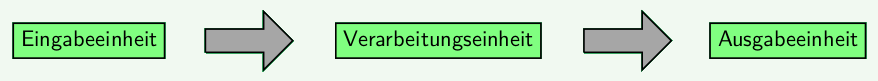

In diesem Kapitel hast du bereits einige Bauteile kennengelernt, aber es gibt noch viele mehr. Um dabei nicht den Überblick zu verlieren, wären Kategorien praktisch, mit denen man Bauteile und informationsverarbeitende Systeme im Allgemeinen einordnen kann.

**Frage:** Wie lassen sich elektrische Bauteile und informationsverarbeitende Systeme kategorisieren?

#### Informationsverarbeitung

Lies die beiden Beschreibungen zur Informationsverarbeitung bei der Straßenlampe und beim Menschen. Beschreibe Gemeinsamkeiten.

**Beispiel Dämmerungsschaltung:**

Der Aufbau von Festwiderstand und LDR ermöglicht die Eingabe von Daten zur Helligkeit. Auf dem Arduino werden die elektrischen Signale entsprechend des laufenden Programms verarbeitet. Letztlich erfolgt die Ausgabe durch das Leuchten einer LED, wenn es dunkel ist, bzw. durch das Nicht-Leuchten der LED.

**Beispiel Mensch:**

Unsere Sinne (Augen zum Sehen, Ohren zum Hören, …) ermöglichen die Eingabe von Informationen in das System Mensch. Im Gehirn und den weiteren Nervenbahnen im Körper werden die Signale verarbeitet. Schließlich kommt es zu einer Ausgabe - zum Beispiel zu einer Bewegung (Musik leiser drehen, Augen zukneifen, sprechen mit dem Mund …).

!!!! #### Das EVA-Prinzip
!!!! 
!!!! Informationsverarbeitende Systeme lassen sich nach ihrer Funktion in drei Einheiten zerlegen: Eingabeeinheit, Verarbeitungseinheit, Ausgabeeinheit.
!!!! 
!!!! 
!!!! 
!!!! Mit dem EVA-Prinzip wird die grundlegende Reihenfolge der Verarbeitung von Daten charakterisiert. Dies kann sowohl auf Hardwareebene (Bauteile) als auch auf Softwareebene (Programm) geschehen.
!!!!
!!!! 

!!!! 

!!!! 

!!!! 

#### Kleines Begriffstraining

1.  Kategorisiere die [Juke-Box](https://mintorials.de/de/arduinoskript/algorithmische-grundlagen/bausteine-von-algorithmen/einfache-entscheidungen-programmieren#juke-box) nach dem EVA-Prinzip.
2.  Kategorisiere den [Reaktionszeitmesser](https://mintorials.de/de/arduinoskript/algorithmische-grundlagen/bausteine-von-algorithmen/wiederholungen-und-zufaellige-ereignisse#reaktionszeitmesser) nach dem EVA-Prinzip.

