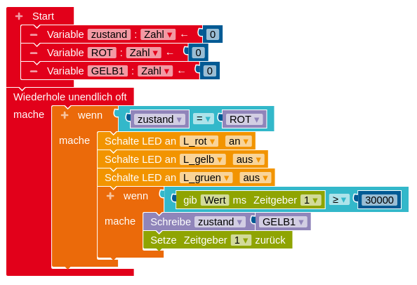

Bisher wurden Algorithmen rezeptartig als feste Handlungsabfolgen beschrieben, die nacheinander durchlaufen werden und dabei ggf. einfache Fallunterscheidungen berücksichtigen. In der Automatentheorie steht weniger das Befolgen eines Rezeptes im Mittelpunkt als das Einnehmen verschiedener Zustände, zwischen denen unter festgelegten Bedingungen Übergänge stattfinden. Dies macht die Algorithmen flexibler im Umgang mit Eingaben aus der Umwelt, wodurch sie zudem leichter zu erweitern sind.

**Ziel:** Durch eine zustandsbasierte Modellierung sollen Algorithmen flexibler werden und einfacher zu erweitern.

#### Zustände programmieren

Ein einfaches Beispiel für einen Automaten mit zwei Zuständen ist eine LED, die über einen Taster an- und wieder ausgeschaltet werden kann. Das folgende Diagramm stellt dies übersichtlich dar.

1. Begründe, warum dieses Modell nicht (nur) über das übliche `wenn Taste T gedrückt` programmiert werden kann, sondern zusätzliche Strukturen benötigt.
2. Im Folgenden werden drei Varianten für die Programmierung des LED-Automaten abgebildet.
	a. Beschreibe, wie die Programme aufgebaut sind.
	b. Vergleiche die Programme bezüglich Gemeinsamkeiten und Unterschieden. Welche Vor- und Nachteile ergeben sich aus den Unterschieden?

 

 

 

!!!! #### Variablen mit konstanten Werten
!!!! Per Konvention erhalten Variablen, deren Wert nicht mehr geändert werden soll, eine Bezeichnung, die nur aus Großbuchstaben besteht wie z. B. `AN` oder `AUS`.

#### Ampelzustände

1.  Nenne die vier Zustände (*engl. states*) einer Ampel. Beschreibe die Bedingung(en), unter denen der Wechsel vom einen in den nächsten Zustand stattfindet.
2.  Unten ist ein sogenanntes Zustandsdiagramm einer Ampel zu sehen. Erläutere, wie es aufgebaut ist und ordne ihnen die vier Ampelzustände zu.
    
    *Hinweis: z: Zustand, t: time (engl. für Zeit)*
    
3.  Unten ist abgebildet, wie ein Programm aussehen könnte, das das Zustandsdiagramm modelliert. Vervollständige das Programm zur Modellierung einer einfachen Ampel und baue die Ampel auf.
    
    *Tipp:* Stelle zuerst den ersten Zustand wie abgebildet fertig. Mit einem Rechtsklick auf den `wenn`-Block kannst du dann alle Blöcke kopieren und musst nur noch die Werte anpassen.
    
    *Erweiterung:* Programmiere jeden Ampelzustand als eigene Funktion, sodass das Programm lesbarer wird.
    
    

*Idee: Materialien zum Kerncurriculum Informatik im Sekundarbereich I, Niedersächsisches Kultusministerium*

Bei einer klassischen Programmierung mit `warte`-Blöcken wäre eine Erweiterung um eine Fußgängerampel, die zu jedem beliebigen Zeitpunkt aktiviert werden kann, unmöglich, da das Programm während des Wartens das Drücken der Fußgängerampel gar nicht mitbekommen würde. Durch die zustandsbasierte Modellierung mithilfe einer Stoppuhr lässt sich die Fußgängerampel jedoch integrieren.

#### Erweiterung um eine Fußgängerampel

Eine Fußgängerampel ist zunächst aus oder deaktiviert. Sie kann jederzeit durch einen Taster aktiviert werden, das heißt, sie zeigt rot. Sie bleibt solange rot, bis die normale Ampel ebenfalls rot zeigt und eine gewisse Mindestdauer vergangen ist. Die normale Ampel bleibt nun rot, während die Fußgängerampel auf grün springt. Nach einer gewissen Zeit schaltet die Fußgängerampel wieder auf rot. Nach ein paar Sekunden Rotphase für die letzten Fußgänger, die ihren Weg über die Straße noch beenden müssen, ist die Fußgängerampel wieder aus und die normale Ampel springt in die Rot-Gelb-Phase, mit der sie ihren normalen Rhythmus fortsetzt.

1.  Entnimm der obigen Beschreibung die vier Zustände einer Fußgängerampel und die Bedingungen, unter denen vom einen Zustand in den nächsten gewechselt wird. Entwickle daraus ein Zustandsdiagramm für die Fußgängerampel. Ergänze die Übergänge von der Rotphase der normalen Ampel zur Rotphase der Fußgängerampel und von der (wieder) deaktivierten Fußgängerampel zur Rot-Gelb-Phase der normalen Ampel.
    
    *Achtung:* Hier liegen zwei Automaten vor, nämlich die normale Ampel und die Fußgängerampel, daher gibt es auch zwei Startzustände.

2.  Ergänze die Fußgängerampel inkl. Taster auf dem Steckbrett und ergänze das Programm der Ampel (siehe oben) um die Zustände der Fußgängerampel.
    
    *Tipp:* Da der Taster jederzeit gedrückt werden kann, benötigt man eine Wahrheitswert-Variable `tasterGedrueckt`, die auf `wahr` gesetzt wird, wenn der Taster gedrückt wurde, damit sich das Drücken speichern lässt, bis es relevant wird. Die Abfrage `wenn Taster gedrückt` kann in jedem Zustand einzeln integriert werden oder nur einmal in der `wiederhole fortlaufend`-Schleife.

Rücklink (öffnet in neuem Tab): <a href="https://mintorials.de/de/arduinoskript/algorithmische-grundlagen/bausteine-von-algorithmen/einfache-entscheidungen-programmieren#taster" target="_blank">Taster</a>

*Idee: Materialien zum Kerncurriculum Informatik im Sekundarbereich I, Niedersächsisches Kultusministerium*

!!!! #### Endlicher Automat und Zustandsdiagramm
!!!! Ein **Automat** (auch: abstrakte Maschine) ist in der Informatik ein Modell zur Beschreibung einer Datenverarbeitung. Er befindet sich anfangs in seinem Startzustand. Abhängig von der nächsten Eingabe (z. B. das Ablaufen einer Zeit oder das Drücken eines Tasters) und des aktuellen Zustands erfolgt der Übergang in einen Folgezustand. Auch zu diesem gibt es wiederum einen Folgezustand, der abhängig von der nächsten Eingabe und dem aktuellen Zustand erreicht wird. Es kann einen oder mehrere Endzustände geben, die keinen Folgezustand haben, wenn der Ablauf des Automaten vollständig ausgeführt wurde. Wenn der Automat endlich viele Zustände hat, spricht man von einem **endlichen Automaten** (auch: Zustandsmaschine, Zustandsautomat, *engl. finite state machine*).
!!!! 
!!!! Ein **Zustandsdiagramm** veranschaulicht das Verhalten eines endlichen Automaten. Die Zustände werden mit einem Kreis oder abgerundeten Rechteck dargestellt. Die Übergänge werden mit Pfeilen dargestellt, an denen die Bedingung für den Übergang steht. Der Startzustand wird mit einem zusätzlichen Pfeil markiert, an den manchmal zusätzlich `start` geschrieben wird. Der ggf. vorhandene Endzustand wird durch einen doppelten Rahmen markiert.
!!!! 

#### Stoppuhr / Timer

1. Eine Stoppuhr besteht aus zwei Tastern und einem Display. Mit dem einen Taster kann die Zeitmessung gestartet bzw. fortgeführt und gestoppt bzw. pausiert werden. Mit dem anderen Taster wird die Zeit wieder auf null zurückgesetzt.

    <figure class="image-caption">
    
    <figcaption><a href="https://commons.wikimedia.org/wiki/File:Stoppuhr_digital.jpg">J. Lesselich</a>, <a href="https://creativecommons.org/licenses/by-sa/3.0">CC BY-SA 3.0</a>, via Wikimedia Commons</figcaption>
    </figure>

	Zeichne ein Zustandsdiagramm für die Stoppuhr. Implementiere dann dein Modell.
    
    *Tipp:* Lege eine Variable für die Zeit an. Nutze die Zeitgeber-Blöcke, um diese Variable um 1 hochzuzählen, wenn (mehr als) 1000 Millisekunden vergangen sind.
    
    Rücklinks (öffnen in neuem Tab): <a href="https://mintorials.de/de/arduinoskript/algorithmische-grundlagen/bausteine-von-algorithmen/einfache-entscheidungen-programmieren#taster" target="_blank">Taster</a>, <a href="https://mintorials.de/de/arduinoskript/bauteilkunde/aktoren/oled-display-ssd1306">OLED-Display</a>, <a href="https://mintorials.de/de/arduinoskript/bauteilkunde/aktoren/liquid-crystal-display-lcd">LC-Display</a>

2. Entwickle ein Automatenmodell für einen Timer. Gehe dazu von einer Startzeit von 15 Sekunden aus.
    
    Zusatz: Ergänze eine Möglichkeit, um die Startzeit vom Anwender festlegen zu lassen.

#### Parkplatzschranke

Auf einen Parkplatz kommt man häufig erst, wenn man einen Parkschein gezogen hat. Danach öffnet sich die Schranke und man kann auf den Parkplatz fahren. Die Schranke schließt sich automatisch wieder, nachdem das Auto hindurchgefahren ist. Beim Verlassen des Parkplatzes muss man wiederum zuerst den bezahlten Parkschein einlesen lassen, bevor sich die Schranke öffnet und automatisch wieder schließt, nachdem ein Auto hindurchgefahren ist.

Das Verhalten der Parkplatzschranke soll auf dem Steckbrett simuliert werden. Dazu wird aus Pappe ein “Auto” geschnitten, das durch die mittlere Spalte des Steckbretts “fährt”.

1.  Erläutere, wie man die Kartenleser und das Durchfahren der Schranke mithilfe von zwei Tastern und zwei Lichtschranken simulieren kann. Notiere alle benötigten Bauteile.
2.  Baue die Parkplatzschranke mit allen benötigten Teilen auf dem Steckbrett auf.
3.  Entwickle ein Automatenmodell für die Parkplatzschranke. Überlege dazu, in welchen Zuständen sich die einzelnen Elemente beim Einfahren und beim Ausfahren befinden.
4.  Implementiere das Automatenmodell.

Rücklinks (öffnen in neuem Tab): <a href="https://mintorials.de/de/arduinoskript/algorithmische-grundlagen/bausteine-von-algorithmen/einfache-entscheidungen-programmieren#taster" target="_blank">Taster</a>, <a href="https://mintorials.de/de/arduinoskript/algorithmische-grundlagen/bausteine-von-algorithmen/der-serielle-monitor" target="_blank">LDR</a>, <a href="https://mintorials.de/de/arduinoskript/bauteilkunde/aktoren/servo" target="_blank">Servo</a>

*Idee: Materialien zum Kerncurriculum Informatik im Sekundarbereich I, Niedersächsisches Kultusministerium*

