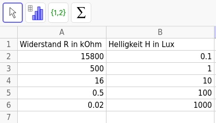
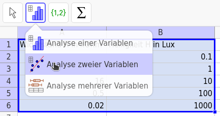
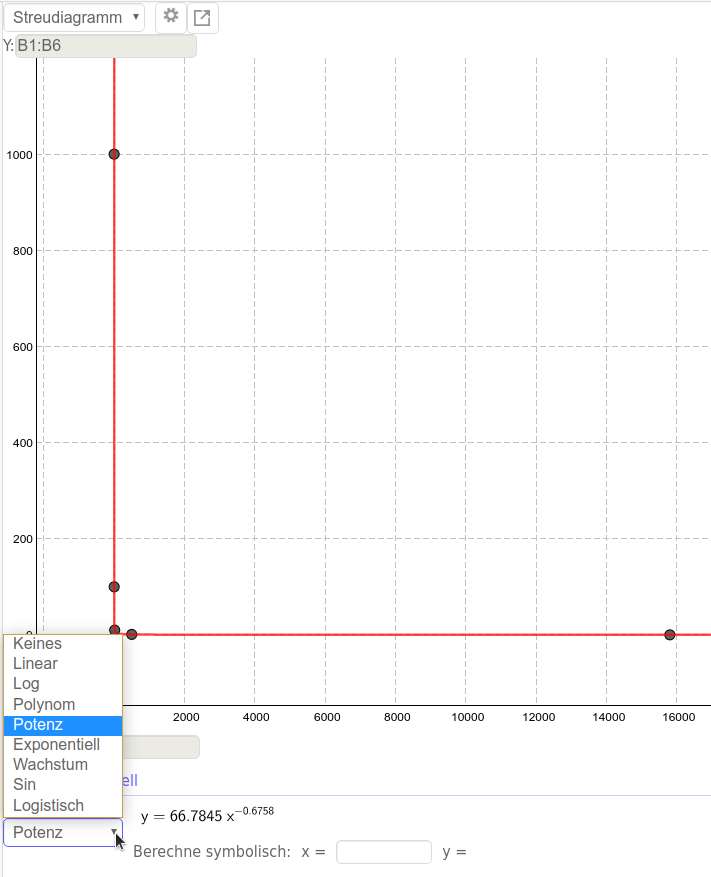
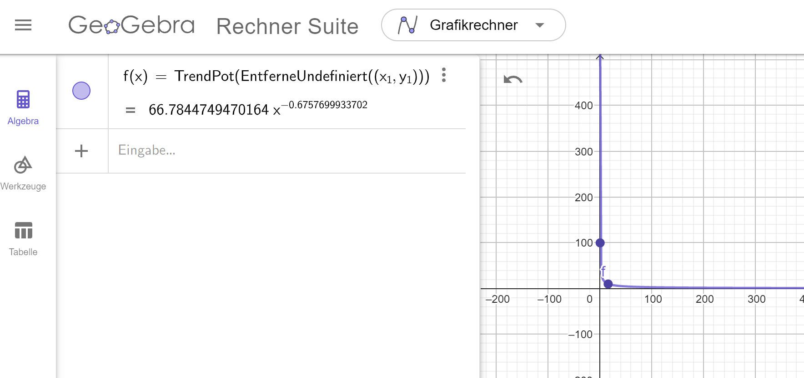
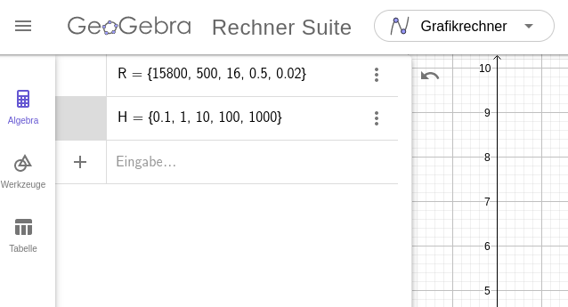
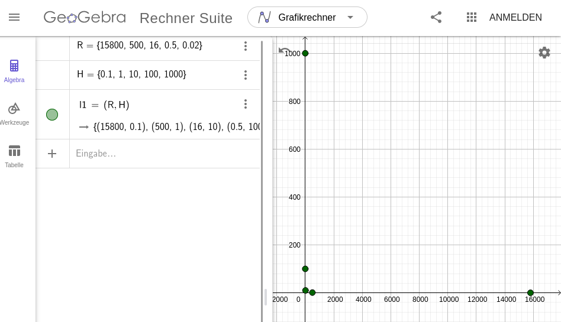
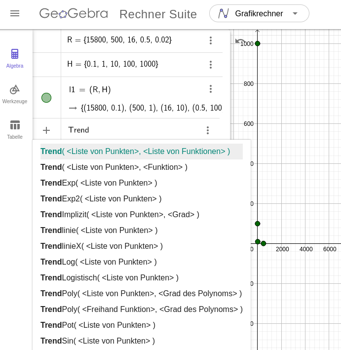
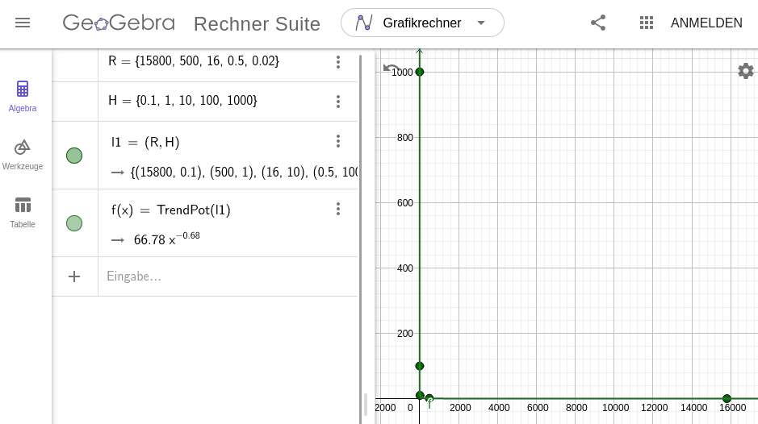

In diesem Abschnitt wird gezeigt, wie man mit verschiedenen Werkzeugen eine Regression durchführt, um einen funktionalen Zusammenhang zu ermitteln. Als Beispiel dienen Daten zur Helligkeit und zur Spannung an einem LDR.

!!!! #### Eine Regression durchführen
!!!! 
!!!! Beim Durchführen einer Regression wird diejenige Funktion(sgleichung) ermittelt, die am besten zu den gegebenen Daten passt. Die Art der Funktion muss jedoch vom Anwender sinnvoll festgelegt werden.

Regression mit Geogebra Classic

**1.** Starte Geogebra Classic und wähle als Perspektive die Tabellenkalkulation. Übertrage die Daten in die Tabellenkalkulation.

**2.** Markiere alle Daten und wähle das Werkzeug `Analyse zweier Variablen`. Die Daten aus Spalte A werden automatisch als x-Koordinate gewählt, die aus Spalte B als y-Koordinate. Bei Bedarf kann dies mit $X \rightleftarrows Y$ vertauscht werden (oben rechts).

**3.** Führe eine Regression durch, indem du unten links ein passendes Regressionsmodell wählst. Welche Funktionsklasse könnte zu der Verteilung der Werte passen? Falls die ausprobierte Funktionsklasse nicht zu den Werten passt, probiere eine andere Funktionsklasse.

*Hinweis:* Die Anzahl der Nachkommastellen lässt sich in den Einstellungen unter “Runden” ändern.

**4.** Übersetze die Funktionsgleichung in den physikalischen Zusammenhang. Für den Widerstand ist das Formelzeichen $R$ festgelegt. Für die Helligkeit wählen wir an dieser Stelle $H$.

$$
y = 66,78 \cdot x^{-0,66} \\
\downarrow \hspace{2.2cm} \downarrow \hspace{1cm} \\
H = 66,78 \cdot R^{-0,66} \\
R \text{ in }  \,  k\Omega, ~ H \text{ in Lux} 
$$

Regression mit Geogebra Rechner Suite (einfache Variante mit Regressionsmenü)

Auf dem Tablet empfiehlt sich der Einsatz der Geogebra Rechner Suite statt Geogebra Classic. Innerhalb der Rechner Suite sollte der **Grafikrechner** oder der **CAS-Rechner** verwendet werden.

**1.** Öffne die Tabellenansicht. Gib die Widerstandswerte als x-Werte in die $x$-Spalte ein. Die Helligkeitswerte werden in die $y_1$-Spalte eingegeben.

**2.** Öffne das Drei-Punkte-Menü neben $y_1$ und wähle die Option "Regression".

**3.** Wähle ein passendes Regressionsmodell. Die Gleichung und die Werte der Parameter werden dann angezeigt. Durch einen Klick auf Zeichnen erhält man den Graphen und die Funktionsgleichung wird in der Algebra-Ansicht eingefügt.
*Hinweis:* In der Algebra-Ansicht sieht man, dass automatisch der entsprechende Trend-Befehl von Geogebra genutzt wurde. Als Argument dient eine Liste von Punkten, die mit $(x_1, y_1)$ erzeugt wird. Dies kann man auch manuell eingeben - eine Anleitung dazu findet sich im nächsten ausklappbaren Abschnitt.

**4.** In den Einstellungen (Zahnrad oben rechts) kann die Anzahl der Nachkommastellen angepasst werden, falls nötig. Übersetze dann die Funktionsgleichung in den physikalischen Zusammenhang. Für den Widerstand ist das Formelzeichen $R$ festgelegt. Für die Helligkeit wählen wir an dieser Stelle $H$.

$$
y = 66,78 \cdot x^{-0,66} \\
\downarrow \hspace{2.2cm} \downarrow \hspace{1cm} \\
H = 66,78 \cdot R^{-0,66} \\
R \text{ in }  \,  k\Omega, ~ H \text{ in Lux} 
$$

Regression mit Geogebra Rechner Suite / Grafikrechner (fortgeschrittene Variante mit Befehlen)

Auf dem Tablet empfiehlt sich der Einsatz der Geogebra Rechner Suite statt Geogebra Classic, allerdings verfügt diese noch nicht über das Statistik-Modul von Classic, weshalb man hier mit ein paar Befehlen arbeiten muss (Stand: Januar 2021). Innerhalb der Rechner Suite sollte der Grafikrechner verwendet werden.

**1.** Gib die Daten jeweils als Liste, also mit geschweiften Klammern, in die Eingabezeile ein. Benenne die Liste mit den Widerstandswerten als `R` und die Liste mit den Helligkeitswerten als `H`.

**2.** Erzeuge aus beiden Listen eine Liste von Punkten mit den Widerstandswerten als x-Koordinate und den Helligkeitswerten als y-Koordinate. Dazu werden die Listen als Koordinaten eines Punktes verwendet (siehe Screenshot).

**3.** Nutze einen der Trend-Befehle und übergib diesem die Liste mit den Punkten, um eine entsprechende Regressionsfunktion zu erhalten.

| Regression | Befehl | Hilfe-Seite |
|:-----------------|:----------|:----------------|
| Linear         | `Trendlinie(<Liste von Punkten>)` | [Trendlinie-Hilfe](https://wiki.geogebra.org/de/Trendlinie_(Befehl)?target=_blank)|
| Polynom | `TrendPoly(<Liste von Punkten>, <Grad>)` | [TrendPoly-Hilfe](https://wiki.geogebra.org/de/TrendPoly_(Befehl)?target=_blank) |
| Sinus | `TrendSin(<Liste von Punkten>)` | [TrendSin-Hilfe](https://wiki.geogebra.org/de/TrendSin_(Befehl)?target=_blank) |
| Potenzfunktion | `TrendPot(<Liste von Punkten>)` | [TrendPot-Hilfe](https://wiki.geogebra.org/de/TrendPot_(Befehl)?target=_blank) |
| Exponentialfunktion mit beliebiger Basis | `TrendExp2(<Liste von Punkten>)` | [TrendExp2-Hilfe](https://wiki.geogebra.org/de/TrendExp2_(Befehl)?target=_blank) |

**4.** In den Einstellungen (Zahnrad oben rechts) kann die Anzahl der Nachkommastellen angepasst werden, falls nötig. Übersetze dann die Funktionsgleichung in den physikalischen Zusammenhang. Für den Widerstand ist das Formelzeichen $R$ festgelegt. Für die Helligkeit wählen wir an dieser Stelle $H$.

$$
y = 66,78 \cdot x^{-0,66} \\
\downarrow \hspace{2.2cm} \downarrow \hspace{1cm} \\
H = 66,78 \cdot R^{-0,66} \\
R \text{ in }  \,  k\Omega, ~ H \text{ in Lux} 
$$

Regression mit TI-Nspire

**1.** Erstelle ein neues Dokument mit einer Seite “Lists & Spreadsheet”. Benenne eine Spalte als `rw` (Werte für R, also der Widerstand) und eine Spalte als `hw` (Werte für die Helligkeit). Ergänze die Werte.

**2.** Füge eine neue Seite “Data & Statistics” hinzu (mit `ctrl` $\rightarrow$ `+page`). Da wir die Helligkeit in Abhängigkeit vom Widerstand berechnen wollen, kommt der Widerstand auf die Rechtsachse und die Helligkeit auf die Hochachse.

**3.** Führe eine Regression durch (`menu` $\rightarrow$ `4: Analysieren` $\rightarrow$ `6: Regression`). Welche Funktionsklasse könnte zu der Verteilung der Werte passen? Falls die ausprobierte Funktionsklasse nicht zu den Werten passt, mache die Regression rückgängig (`ctrl` $\rightarrow$ `esc`) und probiere eine andere Funktionsklasse.

*Achtung:* Durch die geringe Auflösung des Taschenrechners können auch passende Funktionen ggf. falsch aussehen.

**4.** Übersetze die Funktionsgleichung in den physikalischen Zusammenhang. Für den Widerstand ist das Formelzeichen $R$ festgelegt. Für die Helligkeit wählen wir an dieser Stelle $H$.

$$
y = 66,78 \cdot x^{-0,66} \\
\downarrow \hspace{2.2cm} \downarrow \hspace{1cm} \\
H = 66,78 \cdot R^{-0,66} \\
R \text{ in }  \,  k\Omega, ~ H \text{ in Lux} 
$$

