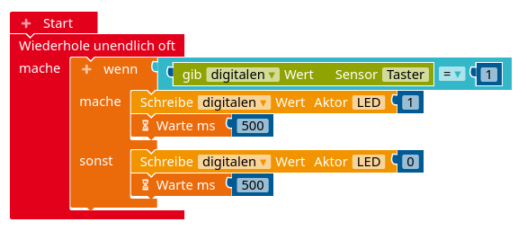

#### Reihenschaltung

Eine rote LED soll an Pin 13 des Arduino betrieben werden. Durch die LED soll eine Stromstärke von $ 10\,  mA$ fließen, was bei einer Spannung von $ 2,1\, V$ an der LED der Fall ist.

1.  Zeichne den zugehörigen Schaltplan.
2.  Berechne, wie groß der Vorwiderstand gewählt werden muss, damit diese Werte erreicht werden.

#### Parallelschaltung

Drei grüne LEDs sollen parallel geschaltet an Pin 13 des Arduino angeschlossen und mit einem gemeinsamen Vorwiderstand betrieben werden. Die LEDs halten eine Stromstärke von maximal $ 20\,  mA$
bei einer Spannung von $ 3,3\, V$ aus.

1.  Zeichne den zugehörigen Schaltplan.
2.  Ein Digitalpin am Arduino darf maximal mit einer Stromstärke von $ 40\,  mA$ belastet werden. Berechne, welche Stromstärke dann maximal durch die einzelnen LEDs fließen darf.
3.  Der Tabelle unten kannst du den zugehörigen Spannungswert an den LEDs entnehmen. Berechne, wie groß der gemeinsame Vorwiderstand der LEDs sein muss, damit die in 2) berechnete Stromstärke eingehalten wird.
    
    

    |  **Spannung U**   | 3,03 V | 3,07 V | 3,1 V | 3,13 V | 3,16 V | 3,19 V |
    | :---------------: | :----: | :----: | :---: | :----: | :----: | :----: |
    | **Stromstärke I** | 10 mA  | 11 mA  | 12 mA | 13 mA  | 14 mA  | 15 mA  |
    

#### Schaltung einer RGB-LED

Eine RGB-LED besteht aus drei einzelnen LEDs (rot, grün, blau), die jeweils über einen eigenen Digitalpin angesteuert werden (vgl. Schaltplan unten).

Am gemeinsamen GND-Anschluss soll ein gemeinsamer Vorwiderstand für alle LEDs angebracht werden, um die Stromstärke auf maximal $ 15\,  mA$ zu begrenzen. Die Spannung an den LEDs sollte dann $ 2,25\, V$ nicht überschreiten.

1.  Erkläre, welche Unterschiede zur Parallelschaltung von drei LEDs an *einem* Digitalpin zu beachten sind.
2.  Berechne, wie groß der gemeinsame Vorwiderstand mindestens sein muss.

#### Pullup-Widerstand und elektrisches Potential

In der Abbildung wird ein Taster mit einem sogenannten Pullup-Widerstand an den Arduino angeschlossen. Links ist der Taster offen, rechts ist der Taster geschlossen.

1. Markiere die Kabel jeweils farbig, sodass die Kabel, die auf dem gleichen elektrischen Potential liegen, die gleiche Farbe haben. Notiere zudem den Wert des elektrischen Potentials.
2. Im Open Roberta Lab wird die Board-LED auf dem Arduino als digitaler Aktor konfiguriert. Zudem wird der Taster als digitaler Sensor konfiguriert. Erkläre, wie sich die Schaltung verhält, wenn das unten abgebildete Programm auf dem Arduino läuft.

#### Pulsweitenmodulation

1. Berechne die mittlere Spannung, die mit dem Befehl `Schreibe analogen Wert Aktor A 135` ausgegeben wird.
2. Mit dem in 1) genannten Befehl wird eine Pulsweitenmodulation durchgeführt. Erkläre, was darunter zu verstehen ist.
3. Jannik meint: "Mit dem Befehl in a) kann ich eine blaue LED auch ohne Vorwiderstand betreiben, denn die halten die berechnete Spannung aus." Nimm dazu Stellung.

#### Spannungsmessung

Mit der unten abgebildeten Schaltung sollen am Arduino Spannungen an der Batterie bis zu 15V gemessen werden.

1. Nenne mögliche, sinnvolle Größen für die Widerstände $R_1$ und $R_2$. Begründe, warum sie möglichst groß sein sollten.
2. Im analogen Eingang A2 wird ein Wert von 789 gemessen. Berechne die Spannung an der Batterie.

#### Mehrere Taster an einem analogen Eingang

Um in größeren Projekten mit dem Arduino digitale Pins einzusparen, sollen mehrere Taster an einem analogen Pin angeschlossen werden (vgl. Schaltplan unten). Die Größe der Widerstände ist in der Tabelle daneben angegeben. Durch Auswertung des Analogwertes soll bestimmt werden, welcher der Taster gedrückt wurde. 

| Widerstand | Größe | 
| :---- | :------------- | 
| $R_1$   |  $220 \Omega$   | 
| $R_2$  |  $330 \Omega$  |
| $R_3$  |  $660 \Omega$   | 
| $R_4$  |  $1 k\Omega$   | 

**Aufgabenteil 1: Kein Taster gedrückt**
1. Berechne den Gesamtwiderstand und die Stromstärke.
2. Berechne den Teilwiderstand zwischen A0 und GND und die Spannung, die an diesem anliegt.
3. Berechne den Analogwert in A0.

**Aufgabenteil 2: Auswirkung der Taster**
1. Erläutere, was sich durch das Drücken der Taster ändert und inwiefern sich das Drücken der Taster dabei unterscheidet.
2. Berechne die fehlenden Größen in der folgenden Tabelle. Erläutere damit, wie man anhand des Analogwertes in A0 entscheiden kann, welcher Taster gedrückt wurde.

|  | Taster $T_1$ gedrückt | Taster $T_2$ gedrückt | Taster $T_3$ gedrückt | 
|----|-----------------------------|--------------------------------|-------------------------------|
| (Gesamt-)Stromstärke $I$ |                                |                                       |                                     |
| Teilwiderstand zw. A0 und GND |                      |                             |                       |
| Spannung zw. A0 und GND |                          |                              |                    |
| Analogwert in A0            |                               |                              |                    |

