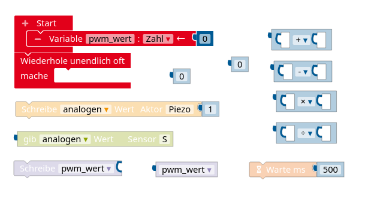

#### Potentiometer

1. Erläutere die Funktionsweise eines Potentiometers und nenne ein Einsatzbeispiel.
2. Skizziere, wie man ein Potentiometer am Arduino anschließt.
3. Ein Potentiometer hat einen Gesamtwiderstand von $R_{ges}=10\,k\Omega$. Der mittlere Kontakt wird im analogen Eingang A0 ausgelesen und liefert einen Analogwert von 824. Berechne, wie groß die Teilwiderstände sind.

#### Dimmbarer Lautsprecher

Der Schaltplan unten zeigt ein Potentiometer, dessen mittlerer Kontakt am analogen Eingang A0 eines Arduino angeschlossen ist. Auf der anderen Seite ist ein Piezo-Summer an Digitalpin 6 des Arduino angeschlossen.

Entwickle mit den unten abgebildeten Befehlen ein Programm, das dafür sorgt, dass die Lautstärke des Piezo-Summers durch das Potentiometer gedimmt werden kann. Das Programm soll in einem Struktogramm dokumentiert werden.

#### LDR und NTC - Basics

1. Nenne jeweils einen Einsatzzweck für einen LDR und einen NTC.
2. Beschreibe das Widerstandsverhalten eines LDR (eines NTC), wenn sich die Helligkeit (die Temperatur) verringert.
3. Ein NTC ist in einem Spannungsteiler mit einem Festwiderstand $R_F=10\,k\Omega$ am Arduino angeschlossen (siehe Schaltplan unten). Im analogen Eingang A0 wird ein Wert von 643 gemessen. Berechne die Größe des Widerstands des NTC.
4. Die Tabelle unten zeigt für den verwendeten NTC, welche Widerstandswerte $R$ zu welcher Temperatur $T$ gehören. Bestimme mit Hilfe einer quadratischen Regression einen funktionalen Zusammenhang zwischen $R$ und $T$ und berechne damit die Temperatur, die zum Widerstandswert aus Aufgabenteil 3) gehört.

R/T No. **8307**
Widerstand bei 25°:
$R_{25}= 10\,  k\Omega$.  

| T (C) | $R_T/R_{25}$ | 
| :---- | :------------- | 
| 5.0   | 2.252         | 
| 10.0  | 1.8216         |
| 15.0  | 1.4827         | 
| 20.0  | 1.2142        | 
| 25.0  | 1.0000         | 
| 30.0  | 0.82818        | 

#### LDR komplex

Für ein [Moorhuhn Lasertag](https://www.el-voss.de/?p=159) kann man zwei gleichartige LDR in Reihe schalten und wie abgebildet am Arduino anschließen. Jeder LDR soll zu einem Moorhuhn gehören. Durch Einlesen des Wertes in A0 soll ermittelt werden, welches Moorhuhn vom Laser getroffen wurde.

1. Erläutere, welche Auswirkung der Laser beim Treffen eines LDR auf die Widerstände und die Spannungen hat.
2. Erkläre, welcher Wert sich in A0 näherungsweise einstellen sollte, wenn gerade keiner der beiden LDR getroffen ist.
3. Entwickle mit Hilfe der unten abgebildeten Befehle ein Programm, das auf dem seriellen Monitor ausgibt, welches Moorhuhn (welcher LDR) getroffen wurde. Das Programm soll als Struktogramm dargestellt werden.

, das (der) getroffen wurde.")

#### Transistor

Der Schaltplan unten zeigt eine Transistor-Grundschaltung, in der ein Spannungsteiler mit einem Festwiderstand $R_F$ und ein NTC mit Widerstand $R_{NTC}$ verbaut ist. In der folgenden Tabelle ist festgehalten, bei welcher Temperatur der NTC welchen Widerstand hat.

| $T$ in $°C$ | $R$ in $k\Omega$ |
|:---------------:|:--------------------------:|
| 25 | 10 |
| 20 | 12,1 |
|15 | 14,8 |

Bestimme die Größe von $R_F$ so, dass der Transistor bei 25°C (20°C, 15°C) schaltet.

*Hinweis:* Der Transistor schaltet bei einer Spannung von $U_{BE}=0,7V$.

