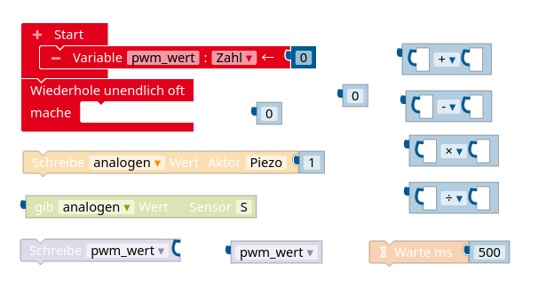

# Elektrische Grundlagen Teil 4: Vermischte Übungen und Ausblick

[TOC]

## Vermischte Übungen

#### Reihenschaltung

Eine rote LED soll an Pin 13 des Arduino betrieben werden. Durch die LED soll eine Stromstärke von $ 10\,  mA$ fließen, was bei einer Spannung von $ 2,1\, V$ an der LED der Fall ist.

1.  Zeichne den zugehörigen Schaltplan.
2.  Berechne, wie groß der Vorwiderstand gewählt werden muss, damit diese Werte erreicht werden.

#### Parallelschaltung

Drei grüne LEDs sollen parallel geschaltet an Pin 13 des Arduino angeschlossen und mit einem gemeinsamen Vorwiderstand betrieben werden. Die LEDs halten eine Stromstärke von maximal $ 20\,  mA$
bei einer Spannung von $ 3,3\, V$ aus.

1.  Zeichne den zugehörigen Schaltplan.
2.  Ein Digitalpin am Arduino darf maximal mit einer Stromstärke von $ 40\,  mA$ belastet werden. Berechne, welche Stromstärke dann maximal durch die einzelnen LEDs fließen darf.
3.  Der Tabelle unten kannst du den zugehörigen Spannungswert an den LEDs entnehmen. Berechne, wie groß der gemeinsame Vorwiderstand der LEDs sein muss, damit die in 2) berechnete Stromstärke eingehalten wird.
    
    

    |  **Spannung U**   | 3,03 V | 3,07 V | 3,1 V | 3,13 V | 3,16 V | 3,19 V |
    | :---------------: | :----: | :----: | :---: | :----: | :----: | :----: |
    | **Stromstärke I** | 10 mA  | 11 mA  | 12 mA | 13 mA  | 14 mA  | 15 mA  |
    

#### Schaltung einer RGB-LED

Eine RGB-LED besteht aus drei einzelnen LEDs (rot, grün, blau), die jeweils über einen eigenen Digitalpin angesteuert werden (vgl. Schaltplan unten).

Am gemeinsamen GND-Anschluss soll ein gemeinsamer Vorwiderstand für alle LEDs angebracht werden, um die Stromstärke auf maximal $ 15\,  mA$ zu begrenzen. Die Spannung an den LEDs sollte dann $ 2,25\, V$ nicht überschreiten.

1.  Erkläre, welche Unterschiede zur Parallelschaltung von drei LEDs an *einem* Digitalpin zu beachten sind.
2.  Berechne, wie groß der gemeinsame Vorwiderstand mindestens sein muss.

#### Pullup-Widerstand und elektrisches Potential

In der Abbildung wird ein Taster mit einem sogenannten Pullup-Widerstand an den Arduino angeschlossen. Links ist der Taster offen, rechts ist der Taster geschlossen.

1. Markiere die Kabel jeweils farbig, sodass die Kabel, die auf dem gleichen elektrischen Potential liegen, die gleiche Farbe haben. Notiere zudem den Wert des elektrischen Potentials.
2. Im Open Roberta Lab wird die Board-LED auf dem Arduino als digitaler Aktor konfiguriert. Zudem wird der Taster als digitaler Sensor konfiguriert. Erkläre, wie sich die Schaltung verhält, wenn das unten abgebildete Programm auf dem Arduino läuft.

#### Pulsweitenmodulation

1. Berechne die mittlere Spannung, die mit dem Befehl `Schreibe analogen Wert Aktor A 135` ausgegeben wird.
2. Mit dem in 1) genannten Befehl wird eine Pulsweitenmodulation durchgeführt. Erkläre, was darunter zu verstehen ist.
3. Jannik meint: "Mit dem Befehl in a) kann ich eine blaue LED auch ohne Vorwiderstand betreiben, denn die halten die berechnete Spannung aus." Nimm dazu Stellung.

#### Spannungsmessung

Mit der unten abgebildeten Schaltung sollen am Arduino Spannungen an der Batterie bis zu 15V gemessen werden.

1. Nenne mögliche, sinnvolle Größen für die Widerstände $R_1$ und $R_2$. Begründe, warum sie möglichst groß sein sollten.
2. Im analogen Eingang A2 wird ein Wert von 789 gemessen. Berechne die Spannung an der Batterie.

#### Mehrere Taster an einem analogen Eingang

Um in größeren Projekten mit dem Arduino digitale Pins einzusparen, sollen mehrere Taster an einem analogen Pin angeschlossen werden (vgl. Schaltplan unten). Die Größe der Widerstände ist in der Tabelle daneben angegeben. Durch Auswertung des Analogwertes soll bestimmt werden, welcher der Taster gedrückt wurde. 

| Widerstand | Größe | 
| :---- | :------------- | 
| $R_1$   |  $220 \Omega$   | 
| $R_2$  |  $330 \Omega$  |
| $R_3$  |  $660 \Omega$   | 
| $R_4$  |  $1 k\Omega$   | 

**Aufgabenteil 1: Kein Taster gedrückt**
1. Berechne den Gesamtwiderstand und die Stromstärke.
2. Berechne den Teilwiderstand zwischen A0 und GND und die Spannung, die an diesem anliegt.
3. Berechne den Analogwert in A0.

**Aufgabenteil 2: Auswirkung der Taster**
1. Erläutere, was sich durch das Drücken der Taster ändert und inwiefern sich das Drücken der Taster dabei unterscheidet.
2. Berechne die fehlenden Größen in der folgenden Tabelle. Erläutere damit, wie man anhand des Analogwertes in A0 entscheiden kann, welcher Taster gedrückt wurde.

|  | Taster $T_1$ gedrückt | Taster $T_2$ gedrückt | Taster $T_3$ gedrückt | 
|----|-----------------------------|--------------------------------|-------------------------------|
| (Gesamt-)Stromstärke $I$ |                                |                                       |                                     |
| Teilwiderstand zw. A0 und GND |                      |                             |                       |
| Spannung zw. A0 und GND |                          |                              |                    |
| Analogwert in A0            |                               |                              |                    |

#### Potentiometer

1. Erläutere die Funktionsweise eines Potentiometers und nenne ein Einsatzbeispiel.
2. Skizziere, wie man ein Potentiometer am Arduino anschließt.
3. Ein Potentiometer hat einen Gesamtwiderstand von $R_{ges}=10\,k\Omega$. Der mittlere Kontakt wird im analogen Eingang A0 ausgelesen und liefert einen Analogwert von 824. Berechne, wie groß die Teilwiderstände sind.

#### Dimmbarer Lautsprecher

Der Schaltplan unten zeigt ein Potentiometer, dessen mittlerer Kontakt am analogen Eingang A0 eines Arduino angeschlossen ist. Auf der anderen Seite ist ein Piezo-Summer an Digitalpin 6 des Arduino angeschlossen.

Entwickle mit den unten abgebildeten Befehlen ein Programm, das dafür sorgt, dass die Lautstärke des Piezo-Summers durch das Potentiometer gedimmt werden kann. Das Programm soll in einem Struktogramm dokumentiert werden.

#### LDR und NTC - Basics

1. Nenne jeweils einen Einsatzzweck für einen LDR und einen NTC.
2. Beschreibe das Widerstandsverhalten eines LDR (eines NTC), wenn sich die Helligkeit (die Temperatur) verringert.
3. Ein NTC ist in einem Spannungsteiler mit einem Festwiderstand $R_F=10\,k\Omega$ am Arduino angeschlossen (siehe Schaltplan unten). Im analogen Eingang A0 wird ein Wert von 643 gemessen. Berechne die Größe des Widerstands des NTC.
4. Die Tabelle unten zeigt für den verwendeten NTC, welche Widerstandswerte $R$ zu welcher Temperatur $T$ gehören. Bestimme mit Hilfe einer quadratischen Regression einen funktionalen Zusammenhang zwischen $R$ und $T$ und berechne damit die Temperatur, die zum Widerstandswert aus Aufgabenteil 3) gehört.

R/T No. **8307**
Widerstand bei 25°:
$R_{25}= 10\,  k\Omega$.  

| T (C) | $R_T/R_{25}$ | 
| :---- | :------------- | 
| 5.0   | 2.252         | 
| 10.0  | 1.8216         |
| 15.0  | 1.4827         | 
| 20.0  | 1.2142        | 
| 25.0  | 1.0000         | 
| 30.0  | 0.82818        | 

#### LDR komplex

Für ein [Moorhuhn Lasertag](https://www.el-voss.de/?p=159) kann man zwei gleichartige LDR in Reihe schalten und wie abgebildet am Arduino anschließen. Jeder LDR soll zu einem Moorhuhn gehören. Durch Einlesen des Wertes in A0 soll ermittelt werden, welches Moorhuhn vom Laser getroffen wurde.

1. Erläutere, welche Auswirkung der Laser beim Treffen eines LDR auf die Widerstände und die Spannungen hat.
2. Erkläre, welcher Wert sich in A0 näherungsweise einstellen sollte, wenn gerade keiner der beiden LDR getroffen ist.
3. Entwickle mit Hilfe der unten abgebildeten Befehle ein Programm, das auf dem seriellen Monitor ausgibt, welches Moorhuhn (welcher LDR) getroffen wurde. Das Programm soll als Struktogramm dargestellt werden.

, das (der) getroffen wurde.")

#### Transistor

Der Schaltplan unten zeigt eine Transistor-Grundschaltung, in der ein Spannungsteiler mit einem Festwiderstand $R_F$ und ein NTC mit Widerstand $R_{NTC}$ verbaut ist. In der folgenden Tabelle ist festgehalten, bei welcher Temperatur der NTC welchen Widerstand hat.

| $T$ in $°C$ | $R$ in $k\Omega$ |
|:---------------:|:--------------------------:|
| 25 | 10 |
| 20 | 12,1 |
|15 | 14,8 |

Bestimme die Größe von $R_F$ so, dass der Transistor bei 25°C (20°C, 15°C) schaltet.

*Hinweis:* Der Transistor schaltet bei einer Spannung von $U_{BE}=0,7V$.

## Ausblick

**Offene Fragen:**

  - Wie werden weitere Bauteile angeschlossen und im Programm angesprochen?
  - Wie wird die Programmlogik physikalisch abgebildet?
  - Wie funktionieren solche Bauteile wie LDR, NTC, Dioden, Transistoren?

! #### Motivationsquellen
! - [Laser-Game](https://www.instructables.com/id/Arduino-UNO-Laser-Game/): Ein kleines Spiel, das sich auf einfache Weise nachbauen lässt.
! - [Arduino Garden Controller](https://www.youtube.com/watch?v=O_Q1WKCtWiA): Gartenarbeit muss heute nicht mehr aufwendig sein: Mit einem Arduino lassen sich die Pflanzen automatisch bewässern, wenn die Erde nicht mehr feucht genug ist. Die erhobenen Daten lassen sich außerdem schön visualisieren.
! - [Wetterstation von bitluni](https://www.youtube.com/watch?v=at7wmm9t8UE)
! - [Das Problem mit Wettervorhersagen (*Dr. Whatson*, Youtube)](https://www.youtube.com/watch?v=aHkec8bA8iI): Selbst gebaute Wetterstationen sind beliebte Anfängerprojekte, bei denen meist ein WLAN-fähiger Mikrocontroller auf Basis des ESP8266 zum Einsatz kommt. Dieser lässt sich ebenfalls über die Arduino IDE programmieren. Wer etwas mehr Hintergrundwissen dazu haben will, schaut sich das Video von *Dr. Whatson* an, der außerdem das Projekt [SenseBox](https://www.sensebox.de/) vorstellt.
! - [“Use the force or your brainwaves” (Youtube)](https://www.youtube.com/watch?v=KtSCo6hIlRQ), [“Use the force or your brainwaves” (Projektseite)](https://create.arduino.cc/projecthub/Imetomi/use-the-force-or-your-brainwaves-9e839b): Der Schüler Imets Tamás hat es mithilfe mehrerer Arduinos geschafft, seine Gehirnwellen einzulesen und zu nutzen, um einen Roboter zu steuern!
! - [Autonomes Auto](https://www.instructables.com/id/Self-Driving-Car-Using-Arduinoautonomous-Guided-Ve/): Der Bastler hinter diesem Projekt hat einen Arduino-basierten Prototypen für ein autonomes Auto entworfen.
! - [Pong-Bot](https://www.instructables.com/id/Arduino-Controlled-Game-Pong-Bot-Vs-Human/): Ein kleines witziges Spiel hat dieser Bastler mit einem Arduino automatisiert.
! - [Snack-Automat](https://www.instructables.com/id/Snack-Vending-Machine-Powered-by-Arduino/): Ein Arduino-basierter Snack-Automat!