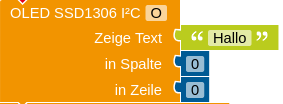

.")
OLED-Displays basieren auf LEDs, die im Gegensatz zu herkömmlichen LEDs aus organischen Materialien hergestellt werden (*OLED* steht für [*organische Leuchtdiode*](https://de.wikipedia.org/wiki/Organische_Leuchtdiode), engl. *organic light-emitting diode*). Bekannt sind OLED-Displays vor allem von Samsung Smartphones mit AMOLED-Display (*active matrix organic light-emitting diode*), aber OLEDs werden auch in Tablets, Fernsehern oder bei der Raumbeleuchtung eingesetzt.

Das SSD1306 ist ein kostengünstiges, kleines Display in *zwei Versionen*: Eine mit 128 x 64 OLEDs und somit 128 x 64 Pixeln und eine mit 128 x 32 OLEDs / Pixeln. *Achtung:* In Onlineshops werden häufig 64 Pixel Höhe angegeben, obwohl nur 32 Pixel Höhe vorhanden sind! Die Bildschirmdiagonale beträgt 0,96", also ca. 2,44cm. Die OLEDs haben in der Regel eine weiße Farbe, es gibt aber auch Versionen mit einer integrierten Farbfolie, sodass blaue und gelbe Farbtöne möglich sind (aber immer nur ein Farbton pro LED). Es verfügt über vier Pins, von denen VCC und GND wie üblich die Stromversorgung sicherstellen, während die Datenübertragung über den [I2C-Datenbus](#i2c-oder-iic-inter-integrated...) realisiert wird. Dazu wird der SCL-Pin mit A5 und der SDA-Pin mit A4 verbunden (siehe Schaltplan / Roboterkonfiguration).

!! Die **Adresse**, unter der das Display über den I2C-Datenbus erreichbar ist, ist in der Regel `0x3D` (Standard bei 128 x 64 Pixeln) oder `0x3C` (Standard bei 128 x 32 Pixeln). Bei manchen Displays kann man die Adresse auch auf der Rückseite ablesen und ggf. abändern, indem man eine Lötstelle überbrückt.

#### Funktionstest des OLED-Displays

1. Schließe das Display wie beschrieben an und gib darauf ein blinkendes "Hello World!" aus. Falls auf dem Display keine Ausgabe erscheint, probiere eine andere Adresse in der Roboterkonfiguration des Displays aus.
2. Die Spaltenangabe bezieht sich auf die 128 Pixel bzw. OLEDs in horizontaler Richtung, während die Zeilenangabe sich auf die 64 Pixel bzw. 32 Pixel in vertikaler Richtung bezieht.
Entnimm der Abbildung des Displays die Pixelhöhe und Pixelbreite der Buchstaben auf dem Display. Begründe damit die Maximalwerte für die Spalte und die Zeile des Text-Befehls für das Display.

|  | min. | max. |
|--|----------|-------|
| Spalte | 0 | 122 |
| Zeile | 0 | 56 bzw. 24 |

 
*Hinweis zur maximalen Zeile:*

56px bei 64 px Höhe und 24px bei 32px Höhe.

#### Messwertanzeige auf dem SSD1306

In vielen Anwendungen soll auf dem Display ein Messwert o. ä. angezeigt werden, der sich mit der Zeit ändern kann. Diese Anzeige soll aber schön formatiert sein.

Erstelle ein Programm, das alle drei Sekunden eine Zufallszahl `z` zwischen 0 und 200 erzeugt und auf dem Display folgende Anzeige ausgibt:

`Messwert: z E`

*Hinweise:*
  - `E` soll für eine beliebige Einheit stehen.
  - Achte darauf, dass der vorherige Wert von `z` gelöscht wird (`Lösche OLED SSD1306 I²C`).
  - Die Ausgabe der Zahl `z` soll immer rechtsbündig erfolgen, sodass zwischen den Einern von `z` und der Einheit genau ein Leerzeichen steht.

!!!! #### I2C oder IIC: Inter-Integrated Circuit
!!!! I2C steht für *[Inter-Intergrated-Circuit](https://de.wikipedia.org/wiki/I%C2%B2C)*. Dies ist ein sogenannter Datenbus, also ein System zur Übertragung von Daten zwischen mehreren Teilnehmern. Die Datenübertragung funktioniert über ein getaktetes An- und Ausstellen der Datenleitung, um die Daten in Binärform (1 und 0) zu übertragen. Neben der Spannungsversorgung (GND und VCC) wird dazu ein Kabel für die serielle Datenübertragung (SDA - Serial Data) und ein Kabel für die Abstimmung des Taktes (SCL - Serial Clock) benötigt.
!!!! Da auch mehrere I2C-kompatible Geräte an denselben Datenbus angeschlossen werden können, bekommt jedes Gerät eine Adresse, damit klar ist, welches Gerät die Daten bekommen soll. Die Adresse wird bei der Konfiguration als Hexadezimalzahl angegeben und kann prinzipiell zwischen 0 und 127 liegen. Typischerweise ist die voreingestellte Adresse `0x27`. Dabei bedeutet `0x`, dass die folgenden beiden Ziffern als Hexadezimalzahl zu interpretieren sind. Falls bereits ein anderes Gerät auf dem gleichen Datenbus dieselbe Adresse hat, kann die Adresse über die Lötbrücken verändert werden (siehe [bastelgarage.ch](https://www.bastelgarage.ch/i2c-schnittstelle-pcf8574-fur-lcd-display)).
!!!! <figure class="image-caption">
!!!!     
!!!!     <figcaption class="">I2C-Bus mit einem Master- und drei Slave-Geräten (Quelle: <a href="https://de.wikipedia.org/wiki/Datei:I2C.svg" target="_blank">Wikpedia</a>), <a href="https://creativecommons.org/licenses/by-sa/3.0/deed.de" target="_blank">CC-BY-SA 3.0</a>, Urheber: <a href="https://en.wikipedia.org/wiki/User:Cburnett" target="_blank">Colin Burnett</a>.</figcaption>
!!!! </figure>

! **Recherche: Vor- und Nachteile der OLED-Technologie**
!
! Auf dem Markt für Displays gibt es immer noch eine harte Konkurrenz und längst nicht alle Hersteller setzen auf OLEDs. Recherchiere, welche Vor- und Nachteile diese Technologie für die Verwendung in Bildschirmen hat.
