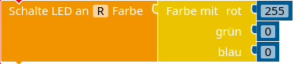

### RGB-LED

Mit einer RGB-LED können die verschiedensten Farben erzeugt werden, die zum Beispiel in Smartphones als Status-LED genutzt werden. Auch in Tastaturen im Gaming-Bereich werden gerne RGB-Farben zur Beleuchtung verwendet.

RGB steht für Rot, Grün und Blau. In einer RGB-LED sind also drei LEDs gleichzeitig verbaut, die sich in unserem Fall eine gemeinsame Anode (Kontakt mit GND) teilen. Die Anode gehört zum längsten Beinchen. Die anderen Kontakte sollten an einen PWM-Pin (gekennzeichet durch eine Tilde: ~) angeschlossen werden.

#### Farbenexperimente

Schließe die RGB-LED wie beschrieben an und experimentiere mit den Befehlen für die Farben. Vervollständige mit Hilfe deiner Experimente die unten stehende Tabelle.

*Hinweis: Die Werte für die Farbanteile von rot, grün und blau reichen von 0 bis 255.*

| Farbe | Farbanteile |
|---|---|
|   |   |
|   |   |
|   |   |
|   |   |
|   |   |
|   |   |

#### Colour-Fading

Wenn man die Farbanteile mit einer Zählschleife durchlaufen lässt, ergeben sich besonders schöne Farbeffekte. Probiere dies in verschiedenen Varianten aus!

<! Farbrad anaylsieren lassen -->

!!!! #### Hintergrund: Das RGB-Farbmodell
!!!! 
!!!! Im RGB-Farbmodell werden alle Farben mit Hilfe von verschiedenen Anteilen von **R**ot, **G**rün und **B**lau zusammengesetzt. Dabei handelt es sich um ein [additives Farbmodell](https://de.wikipedia.org/wiki/Additive_Farbmischung), bei dem die Farbe umso heller wird, je größer der Anteil jeder Farbe ist. Werden rot, grün und blau in voller Stärke vermischt, ergibt sich weiß. Wenn ihr Anteil jeweils null beträgt, ergibt sich schwarz.
!!!! Die Anteile werden durch eine Zahl zwischen 0 und 255 angegeben, welches sich jeweils durch acht Bit bzw. ein Byte speichern lassen. Statt der Dezimalzahlen von 0 bis 255 wird der Anteil auch häufig mit *Hexadezimalzahlen* von $00_{hex}$ bis $ff_{hex}$ angegeben. Der Code sieht dann zum Beispiel so aus: $\#72b9fa$, wobei $72$ der Rotanteil, $b9$ der Grünanteil und $fa$ der Blauanteil ist.

#### Konfiguration mit analogen bzw. PWM-Pins

Wie oben beschrieben handelt es sich bei der RGB-LED eigentlich um drei einzelne LEDs, die jeweils mit einem PWM-Pin verbunden werden müssen, damit die Farbanteile eingestellt werden können.

Überprüfe dies, indem du jede LED einzeln als analogen Aktor konfigurierst und die Farben aus der ersten Aufgabe mit dem Befehl `schalte analogen Wert Aktor <LED Name> <Zahl>` mit einer Zahl von 0 bis 255 erzeugst.

Rücklink: [Pulsweitenmodulation](https://doku.el-voss.de/de/arduinoskript/elektrik/digitale-analoge-pins#pulsweitenmodulation)

