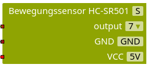
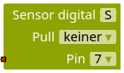

*Bewegungsmelder wurden bereits im Abschnitt [Entscheidungen mit mehreren Kriterien treffen](/arduinoskript/algorithmische-grundlagen/bausteine-von-algorithmen/entscheidungen-mit-mehreren-kriterien) erklärt und genutzt, um Wahrheitswerte einzuführen. In diesem Abschnitt steht das Bauteil im Vordergrund. Dazu werden noch einmal alle Informationen zusammengefasst und eine alternative Programmierung vorgestellt.*

Bewegungsmelder verfügen über drei Pins, deren Beschriftung man lesen kann, wenn man die Kunststofflinse vorsichtig abzieht (*Vorsicht: Nach Abziehen der Linse nicht den Sensor berühren!*). `Vcc` und `GND` dienen der Stromversorgung der elektronischen Komponenten und müssen mit `5V` und `GND` am Arduino verbunden werden.

Der mittlere `OUT`-Pin ist der Signal-Pin: Wenn eine Bewegung registriert wurde, wird der Wert `wahr` zurückgegeben, ansonsten `falsch`. Zum Einlesen des Signals wird dieser Pin mit einem Digitalpin des Arduino verbunden.

Hinten befinden sich zwei Drehregler (“Potentiometer”), mit denen sich die Dauer des Bewegungssignals (links) und die Empfindlichkeit (rechts) einstellen lassen. Zusätzlich befindet sich auf der rechten Seite ein sogenannter Jumper, mit dem auf einfache Weise eine Steckverbindung zwischen benachbarten Pins hergestellt werden kann. Wenn sich der Jumper ganz außen befindet, dann bleibt das Bewegungssignal nach dem Erkennen einer Bewegung eine Weile aktiv und wird dann auf jeden Fall deaktiviert. Eine neue Bewegung kann erst nach einer gewissen Zeit wieder registriert werden. Wenn der Jumper hingegen leicht nach innen versetzt ist, bleibt das Bewegungssignal so lange erhalten, wie eine Bewegung erkannt wird (siehe [Funduino](https://funduino.de/nr-8-bewegungsmelder)).

 

 

  und Empfindlichkeit (rechts).")

*Programmierung:* Der Bewegungsmelder ist in Nepo bereits vorkonfiguriert und lässt sich damit einfach auslesen. Aufgrund der Ausgabe von `HIGH` und `LOW` bzw. `true` und `false` lässt er sich aber auch als digitaler Sensor konfigurieren. Der Rückgabewert eines digitalen Sensors ist in Nepo vom Typ *Zahl* statt vom Typ *Wahrheitswert*. Dabei bedeutet die Zahl `0` so viel wie `false` und die Zahl `1` bedeutet `true`.

#### Automatische Tür

Baue und programmiere eine automatische Tür, die sich öffnet, wenn eine Bewegung registriert wird. Der Bewegungsmelder soll als digitaler Sensor konfiguriert werden. Experimentiere mit den Drehreglern, um die Empfindlichkeit und Dauer des Signals richtig einzustellen.

! **Recherche: Wie funktioniert eigentlich ein Bewegungsmelder?**
! Das zentrale Bauteil eines Bewegungsmelders ist ein sogenannter *Passiver Infrarot Sensor (PIR)*, auch *Pyroelektrischer Sensor*. Recherchiere im Internet, wie solche Sensoren funktionieren und fasse zusammen, wie es zur Registrierung einer Bewegung kommt.
