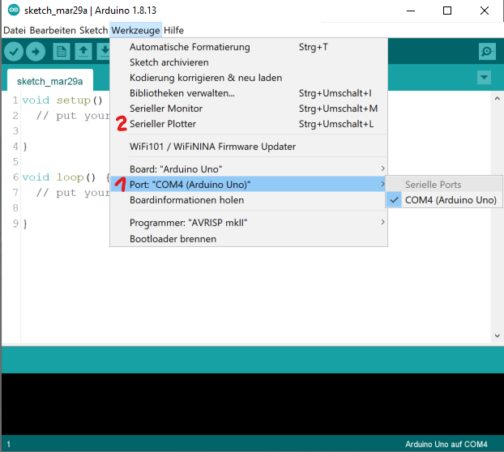

Aktivitätstracker mit Pulsmessung liegen voll im Trend - aber wie funktioniert so ein Pulssensor eigentlich? Das lässt sich am einfachsten verstehen, wenn man selber einen nachbaut. Weitere Anwendungsmöglichkeiten wären übrigens Lügen-/Angstdetektoren, Schlafanalyse oder ein Alarmsystem für Risikopatienten.

Der Anschluss an den Arduino ist einfach: + an 5V, - an GND, der Signalpin S an einen analogen Eingang A[0-5]. Am Signalpin liegt eine Spannung an, die sich im Rhythmus des Herzschlags verändert und am analogen Eingang des Arduino gemessen werden kann. Dies lässt sich mit dem seriellen Plotter der Arduino IDE veranschaulichen (siehe Abbildung unten). Man erkennt, dass die gemessenen Analogwerte zwischen ca. 500 und ca. 535, also in einem relativ kleinen Bereich, schwanken (35 bzw. $0,171 \, V$).

Als Kriterium für einen Herzschlag könnte man festlegen, dass der Analogwert über 520 liegt. Diese Werte sind jedoch wenig stabil und schwanken je nach Person und Umgebung! Man sollte unbedingt darauf achten, dass die Haut nicht verschwitzt ist und keine Bauteile auf dem Sensor berührt werden (insbesondere auf der Rückseite), damit die Ergebnisse einigermaßen zuverlässig sind. Wenn sich auf dem Arm keine brauchbaren Werte einstellen, lohnt sich ein Versuch auf dem Ringfinger oder dem Ohrläppchen.

Der Pulssensor kann mit den vorkonfigurierten Blöcken von Nepo oder direkt als analoger Sensor eingelesen werden. Im Hintergrund passiert das Gleiche.

#### Theorie: Wie wird der Puls gemessen?

Für die Messung des Pulses ist die grüne LED und ein Lichtsensor zentral. Erkläre anhand der schematischen Abbildungen unten das Prinzip der optischen Pulsmessung.

#### Pulsmesser
Baue einen Pulsmesser, der anhand der Messwerte von 10 Sekunden den Puls (Herzschläge pro Minute) berechnet.

*Hinweis: Es kann nötig sein, sich die Werte von einem seriellen Plotter visualisieren zu lassen, um einen Eindruck vom Wertebereich und von der Grenze für die Herzschlagerkennung zu bekommen. Klappe dafür die Anleitung unter diesem Projekt aus.*

Visualisierung mit dem Seriellen Plotter der Arduino IDE

**0.** Vorbereitung: Damit überhaupt Werte über den seriellen Port (USB) übermittelt werden, erstelle ein Programm in Open Roberta, das fortlaufend den aktuellen Wert des Pulssensors auf den seriellen Monitor schreibt und übertrage es auf den Arduino.

**1.** Der Serielle Plotter ist in die Arduino IDE eingebaut, die genutzt wird, um den Arduino textbasiert zu programmieren. [Lade die Arduino IDE herunter](https://www.arduino.cc/en/software) und installiere sie.

**2.** Öffne die Arduino IDE. Zuerst muss der Arduino verbunden werden. Wähle dazu in der oberen Leiste *Werkzeuge* > *Board: Arduino Uno* und wähle unter *Werkzeuge* > *Port* den Port aus, an dem der Arduino angegeben wird (siehe unten).

**3.** Öffne den Seriellen Plotter unter *Werkzeuge* > *Serieller Plotter*. Das Koordinatensystem wird automatisch an die vom Arduino übermittelten Werte angepasst. Falls keine Werte angezeigt werden, dann kontrolliere, ob die Baud-Rate (unten links) auf 9600 eingestellt ist.

