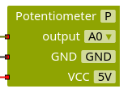

Ein Drehregler oder Potentiometer ist ein Widerstand, der in zwei Teile aufgeteilt wird. Durch Drehen am Griff kann man die Größe der Teile verändern, allerdings bleibt der Gesamtwiderstand immer gleich groß. Durch den einstellbaren Teilwiderstand lässt sich zum Beispiel eine Lampe dimmen oder die Lautstärke eines Lautsprechers regulieren.

Zum Anschluss an den Arduino wird der mittlere Pin mit einem analogen Eingang verbunden, über den die Spannung am Teilwiderstand zwischen GND und dem analogen Eingang abgefragt werden kann. Die anderen beiden Pins müssen mit 5V und GND verbunden werden, wobei es egal ist, welcher Pin mit GND und welcher mit 5V verbunden wird.

Die Grundlagen des Potentiometers werden auch [im Kapitel Elektrische Grundlagen behandelt](../../elektrik/anwendungen-spannungsmessung#drehregler-verwenden).

Für das Potentiometer existiert ein vorkonfigurierter Block, über den man die Spannung am Teilwiderstand zwischen GND und dem analogen Eingang auslesen kann. Diese kann zwischen 0V (Teilwiderstand gleich null) oder 5V (Teilwiderstand gleich Gesamtwiderstand) bewegen. Alternativ kann das Potentiometer als analoger Sensor konfiguriert werden und der Analogwert im Programm abgefragt werden.

#### Dimmbare Lampe

Baue und programmiere eine Lampe, deren Helligkeit sich durch ein Potentiometer einstellen lässt.

*Hinweis:* Du musst dafür sorgen, dass der eingelesene Analogwert zwischen 0 und 1023 in einen PWM-Wert zwischen 0 und 255 umgerechnet wird. Ermittle dazu eine passende Funktion.

